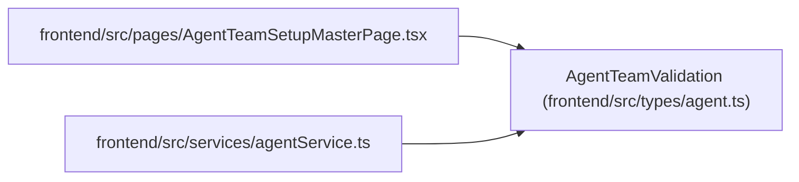

# AgentTeamValidation

**Location:** `frontend/src/types/agent.ts:680`
**Kind:** Class
**Bases:** —
**Module:** [types_agent](../modules/types_agent.md)

## Description

_Auto-generated from `AgentTeamValidation` in `frontend/src/types/agent.ts`._

## Attributes

| Name | Type | Default | Description |
|------|------|---------|-------------|
| `schema_version` | `'agent-team-validation-v1'` | *required* | — |
| `valid` | `boolean` | *required* | — |
| `manifest_digest` | `string` | *required* | — |
| `normalized_manifest` | `AgentTeamMaster` | *required* | — |
| `blocker_codes` | `string[]` | *required* | — |

## Methods

*No public methods. Inherits from base classes.*

## Relationships

<!-- Auto-generated relationship summary. Do not edit by hand. -->

### Summary

| Module | Methods | Attributes |
|---|---:|---|
| [types_agent](../modules/types_agent.md) | 0 | `blocker_codes`, `manifest_digest`, `normalized_manifest`, `schema_version`, `valid` |

### References

| Reference | Kind | Source | Call sites |
|---|---|---|---:|
| `AgentTeamSetupMasterPage` | import | [AgentTeamSetupMasterPage](../modules/AgentTeamSetupMasterPage.md) | — |
| `agentService` | import | [agentService](../modules/agentService.md) | — |
