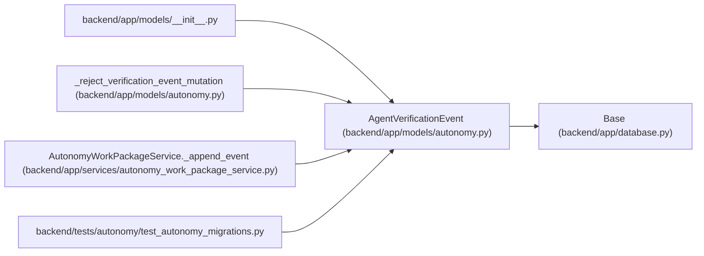

# AgentVerificationEvent

**Location:** `backend/app/models/autonomy.py:273`
**Kind:** Class
**Bases:** `Base`
**Module:** [models_autonomy](../modules/models_autonomy.md)

## Description

Append-only verifier-slot event projection.

## Attributes

| Name | Type | Default | Description |
|------|------|---------|-------------|
| `id` | `Mapped[int]` | `mapped_column(Integer, primary_key=True, autoincrement=True)` | — |
| `requirement_id` | `Mapped[int]` | `mapped_column(Integer, ForeignKey('agent_verification_requirements.id', ondelete='RESTRICT'), nullable=False)` | — |
| `sequence` | `Mapped[int]` | `mapped_column(Integer, nullable=False)` | — |
| `event_type` | `Mapped[str]` | `mapped_column(String(100), nullable=False)` | — |
| `actor_id` | `Mapped[Optional[int]]` | `mapped_column(Integer, ForeignKey('agent_actors.id', ondelete='RESTRICT'), nullable=True)` | — |
| `lease_generation` | `Mapped[int]` | `mapped_column(Integer, nullable=False)` | — |
| `payload_digest` | `Mapped[str]` | `mapped_column(String(64), nullable=False)` | — |
| `previous_hash` | `Mapped[str]` | `mapped_column(String(64), nullable=False)` | — |
| `event_digest` | `Mapped[str]` | `mapped_column(String(64), nullable=False)` | — |
| `idempotency_key` | `Mapped[str]` | `mapped_column(String(255), nullable=False)` | — |
| `created_at` | `Mapped[datetime]` | `mapped_column(UTCDateTime(), default=utc_now, nullable=False)` | — |
| `requirement` | `Mapped[AgentVerificationRequirement]` | `relationship('AgentVerificationRequirement', back_populates='events')` | — |

## Methods

*No public methods. Inherits from base classes.*

## Relationships

<!-- Auto-generated relationship summary. Do not edit by hand. -->

### Summary

| Module | Methods | Attributes |
|---|---:|---|
| [models_autonomy](../modules/models_autonomy.md) | 0 | `actor_id`, `created_at`, `event_digest`, `event_type`, `id`, `idempotency_key`, `lease_generation`, `payload_digest`, `previous_hash`, `requirement`, `requirement_id`, `sequence` |

### Structure

| Kind | Entity | Module |
|---|---|---|
| Base | `Base` | [app_database](../modules/app_database.md) |

### References

| Reference | Kind | Source | Call sites |
|---|---|---|---:|
| `__init__` | import | [models___init__](../modules/models___init__.md) | — |
| `_reject_verification_event_mutation` | type_reference | [models_autonomy](../modules/models_autonomy.md) | — |
| `AutonomyWorkPackageService._append_event` | call | [autonomy_work_package_service](../modules/autonomy_work_package_service.md) | 1 |
| `AutonomyWorkPackageService._append_event` | type_reference | [autonomy_work_package_service](../modules/autonomy_work_package_service.md) | — |
| `test_autonomy_migrations` | import | [test_autonomy_migrations](../modules/test_autonomy_migrations.md) | — |
