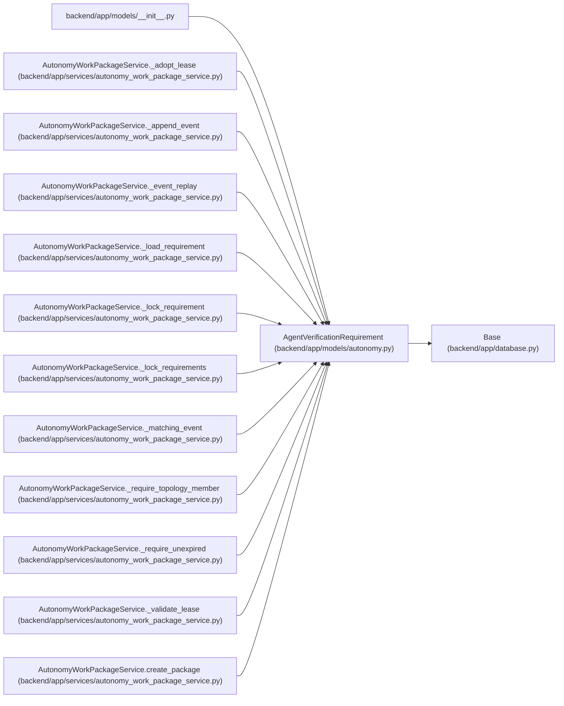

# AgentVerificationRequirement

**Location:** `backend/app/models/autonomy.py:187`
**Kind:** Class
**Bases:** `Base`
**Module:** [models_autonomy](../modules/models_autonomy.md)

## Description

One independently claimable verifier slot with a fenced lifecycle.

## Attributes

| Name | Type | Default | Description |
|------|------|---------|-------------|
| `id` | `Mapped[int]` | `mapped_column(Integer, primary_key=True, autoincrement=True)` | — |
| `package_id` | `Mapped[int]` | `mapped_column(Integer, ForeignKey('agent_work_packages.id', ondelete='RESTRICT'), nullable=False)` | — |
| `slot_key` | `Mapped[str]` | `mapped_column(String(255), nullable=False)` | — |
| `verifier_logical_key` | `Mapped[str]` | `mapped_column(String(100), nullable=False)` | — |
| `state` | `Mapped[str]` | `mapped_column(String(30), default='planned', nullable=False)` | — |
| `assigned_verifier_actor_id` | `Mapped[Optional[int]]` | `mapped_column(Integer, ForeignKey('agent_actors.id', ondelete='RESTRICT'), nullable=True, index=True)` | — |
| `assignment_id` | `Mapped[Optional[int]]` | `mapped_column(Integer, ForeignKey('agent_task_assignments.id', ondelete='RESTRICT'), nullable=True)` | — |
| `criterion_schema` | `Mapped[str]` | `mapped_column(String(255), nullable=False)` | — |
| `artifact_set_digest` | `Mapped[str]` | `mapped_column(String(64), nullable=False)` | — |
| `evaluator_version` | `Mapped[str]` | `mapped_column(String(255), nullable=False)` | — |
| `executor_independence_group` | `Mapped[str]` | `mapped_column(String(100), nullable=False)` | — |
| `verifier_independence_group` | `Mapped[str]` | `mapped_column(String(100), nullable=False)` | — |
| `lease_generation` | `Mapped[int]` | `mapped_column(Integer, default=0, nullable=False)` | — |
| `lease_digest` | `Mapped[Optional[str]]` | `mapped_column(String(64), nullable=True)` | — |
| `attempt_start_digest` | `Mapped[Optional[str]]` | `mapped_column(String(64), nullable=True)` | — |
| `lease_expires_at` | `Mapped[Optional[datetime]]` | `mapped_column(UTCDateTime(), nullable=True)` | — |
| `heartbeat_at` | `Mapped[Optional[datetime]]` | `mapped_column(UTCDateTime(), nullable=True)` | — |
| `evidence_digest` | `Mapped[Optional[str]]` | `mapped_column(String(64), nullable=True)` | — |
| `verdict_digest` | `Mapped[Optional[str]]` | `mapped_column(String(64), nullable=True)` | — |
| `created_at` | `Mapped[datetime]` | `mapped_column(UTCDateTime(), default=utc_now, nullable=False)` | — |
| `updated_at` | `Mapped[datetime]` | `mapped_column(UTCDateTime(), default=utc_now, onupdate=utc_now, nullable=False)` | — |
| `package` | `Mapped[AgentWorkPackage]` | `relationship('AgentWorkPackage', back_populates='requirements')` | — |
| `events` | `Mapped[list['AgentVerificationEvent']]` | `relationship('AgentVerificationEvent', back_populates='requirement', passive_deletes=True, order_by='AgentVerificationEvent.sequence')` | — |

## Methods

*No public methods. Inherits from base classes.*

## Relationships

<!-- Auto-generated relationship summary. Do not edit by hand. -->

### Summary

| Module | Methods | Attributes |
|---|---:|---|
| [models_autonomy](../modules/models_autonomy.md) | 0 | `artifact_set_digest`, `assigned_verifier_actor_id`, `assignment_id`, `attempt_start_digest`, `created_at`, `criterion_schema`, `evaluator_version`, `events`, `evidence_digest`, `executor_independence_group`, `heartbeat_at`, `id` |

### Structure

| Kind | Entity | Module |
|---|---|---|
| Base | `Base` | [app_database](../modules/app_database.md) |

### References

| Reference | Kind | Source | Call sites |
|---|---|---|---:|
| `__init__` | import | [models___init__](../modules/models___init__.md) | — |
| `AutonomyWorkPackageService._adopt_lease` | type_reference | [autonomy_work_package_service](../modules/autonomy_work_package_service.md) | — |
| `AutonomyWorkPackageService._append_event` | type_reference | [autonomy_work_package_service](../modules/autonomy_work_package_service.md) | — |
| `AutonomyWorkPackageService._event_replay` | type_reference | [autonomy_work_package_service](../modules/autonomy_work_package_service.md) | — |
| `AutonomyWorkPackageService._load_requirement` | type_reference | [autonomy_work_package_service](../modules/autonomy_work_package_service.md) | — |
| `AutonomyWorkPackageService._lock_requirement` | type_reference | [autonomy_work_package_service](../modules/autonomy_work_package_service.md) | — |
| `AutonomyWorkPackageService._lock_requirements` | type_reference | [autonomy_work_package_service](../modules/autonomy_work_package_service.md) | — |
| `AutonomyWorkPackageService._matching_event` | type_reference | [autonomy_work_package_service](../modules/autonomy_work_package_service.md) | — |
| `AutonomyWorkPackageService._require_topology_member` | type_reference | [autonomy_work_package_service](../modules/autonomy_work_package_service.md) | — |
| `AutonomyWorkPackageService._require_unexpired` | type_reference | [autonomy_work_package_service](../modules/autonomy_work_package_service.md) | — |
| `AutonomyWorkPackageService._validate_lease` | type_reference | [autonomy_work_package_service](../modules/autonomy_work_package_service.md) | — |
| `AutonomyWorkPackageService.create_package` | call | [autonomy_work_package_service](../modules/autonomy_work_package_service.md) | 1 |

> References: showing 12 of 15 logical references; 3 omitted by the 12-row generated summary limit.
