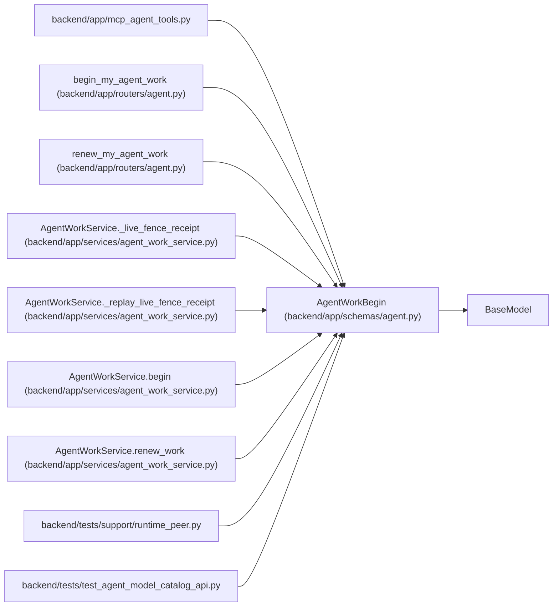

# AgentWorkBegin

**Location:** `backend/app/schemas/agent.py:861`
**Kind:** Pydantic model
**Bases:** `BaseModel`
**Module:** [schemas_agent](../modules/schemas_agent.md)

## Description

Atomically accept and start a server-selected work assignment.

## Model Configuration

| Setting | Value | Source |
|---------|-------|--------|
| `extra` | `'forbid'` | model_config |

## Validators

| Method | Scope | Fields | Mode | Options |
|--------|-------|--------|------|---------|
| `validate_metadata_size` | field | metadata | after | — |

## Attributes

| Name | Type | Wire name | Required | Nullable | Default | Constraints | Examples | Description |
|------|------|-----------|----------|----------|---------|-------------|-------------|----------|
| `assignment_id` | `int` | `assignment_id` | Yes | No | — | — | — | — |
| `queue_revision` | `int` | `queue_revision` | Yes | No | — | ge=1 | — | — |
| `lease_seconds` | `int` | `lease_seconds` | No | No | `3600` | ge=60; le=86400 | — | — |
| `trace_id` | `Optional[str]` | `trace_id` | No | Yes | `None` | max_length=255 | — | — |
| `model` | `Optional[str]` | `model` | No | Yes | `None` | max_length=255 | — | — |
| `tool_name` | `Optional[str]` | `tool_name` | No | Yes | `None` | max_length=255 | — | — |
| `metadata` | `dict[str, Any]` | `metadata` | No | No | factory: `dict` | max_length=unknown (MAX_AGENT_JSON_FIELDS) | — | — |

## Methods

| Method | Signature | Decorators | Description |
|--------|-----------|------------|-------------|
| `validate_metadata_size` | `(value: dict[str, Any]) -> dict[str, Any]` | `@field_validator('metadata')`, `@classmethod` | — |

## Relationships

<!-- Auto-generated relationship summary. Do not edit by hand. -->

### Summary

| Module | Methods | Attributes |
|---|---:|---|
| [schemas_agent](../modules/schemas_agent.md) | 1 | `assignment_id`, `lease_seconds`, `metadata`, `model`, `queue_revision`, `tool_name`, `trace_id` |

### Structure

| Kind | Entity | Module |
|---|---|---|
| Base | `BaseModel` | — |

### References

| Reference | Kind | Source | Call sites |
|---|---|---|---:|
| `mcp_agent_tools` | import | [mcp_agent_tools](../modules/mcp_agent_tools.md) | — |
| `begin_my_agent_work` | type_reference | [routers_agent](../modules/routers_agent.md) | — |
| `renew_my_agent_work` | type_reference | [routers_agent](../modules/routers_agent.md) | — |
| `AgentWorkService._live_fence_receipt` | type_reference | [agent_work_service](../modules/agent_work_service.md) | — |
| `AgentWorkService._replay_live_fence_receipt` | type_reference | [agent_work_service](../modules/agent_work_service.md) | — |
| `AgentWorkService.begin` | type_reference | [agent_work_service](../modules/agent_work_service.md) | — |
| `AgentWorkService.renew_work` | type_reference | [agent_work_service](../modules/agent_work_service.md) | — |
| `runtime_peer` | import | [runtime_peer](../modules/runtime_peer.md) | — |
| `test_agent_model_catalog_api` | import | [test_agent_model_catalog_api](../modules/test_agent_model_catalog_api.md) | — |
