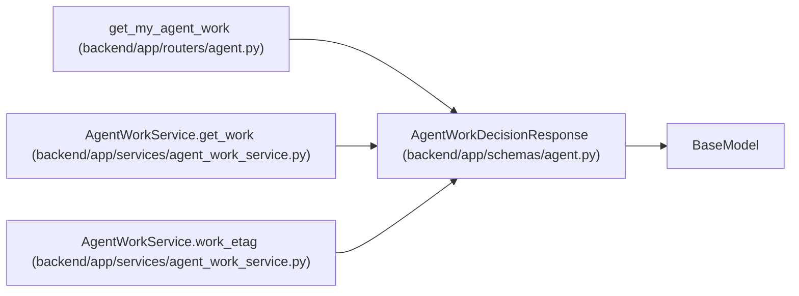

# AgentWorkDecisionResponse

**Location:** `backend/app/schemas/agent.py:807`
**Kind:** Pydantic model
**Bases:** `BaseModel`
**Module:** [schemas_agent](../modules/schemas_agent.md)

## Description

Server-authoritative current/next work decision.

## Attributes

| Name | Type | Wire name | Required | Nullable | Default | Constraints | Examples | Description |
|------|------|-----------|----------|----------|---------|-------------|-------------|----------|
| `actor` | `AgentActorResponse` | `actor` | Yes | No | — | — | — | — |
| `server_time` | `datetime` | `server_time` | Yes | No | — | — | — | — |
| `selection_policy` | `str` | `selection_policy` | No | No | `'assigned-work/v1'` | — | — | — |
| `queue_revision` | `int` | `queue_revision` | Yes | No | — | — | — | — |
| `pagination` | `AgentWorkPaginationMetadata` | `pagination` | Yes | No | — | — | — | — |
| `cursor` | `Optional[str]` | `cursor` | No | Yes | `None` | — | — | — |
| `state` | `Literal['resume', 'start_assigned', 'wait', 'no_work', 'attention_required']` | `state` | Yes | No | — | — | — | — |
| `current` | `Optional[AgentWorkItem]` | `current` | No | Yes | `None` | — | — | — |
| `next` | `Optional[AgentWorkItem]` | `next` | No | Yes | `None` | — | — | — |
| `queue` | `list[AgentWorkItem]` | `queue` | No | No | factory: `list` | — | — | — |
| `blocked_assigned` | `list[AgentWorkItem]` | `blocked_assigned` | No | No | factory: `list` | — | — | — |
| `recovery_codes` | `list[str]` | `recovery_codes` | No | No | factory: `list` | — | — | — |
| `next_poll_after` | `Optional[datetime]` | `next_poll_after` | No | Yes | `None` | — | — | — |

## Methods

*No public methods. Inherits from base classes.*

## Relationships

<!-- Auto-generated relationship summary. Do not edit by hand. -->

### Summary

| Module | Methods | Attributes |
|---|---:|---|
| [schemas_agent](../modules/schemas_agent.md) | 0 | `actor`, `blocked_assigned`, `current`, `cursor`, `next`, `next_poll_after`, `pagination`, `queue`, `queue_revision`, `recovery_codes`, `selection_policy`, `server_time` |

### Structure

| Kind | Entity | Module |
|---|---|---|
| Base | `BaseModel` | — |

### References

| Reference | Kind | Source | Call sites |
|---|---|---|---:|
| `get_my_agent_work` | type_reference | [routers_agent](../modules/routers_agent.md) | — |
| `AgentWorkService.get_work` | call | [agent_work_service](../modules/agent_work_service.md) | 5 |
| `AgentWorkService.get_work` | type_reference | [agent_work_service](../modules/agent_work_service.md) | — |
| `AgentWorkService.work_etag` | type_reference | [agent_work_service](../modules/agent_work_service.md) | — |
