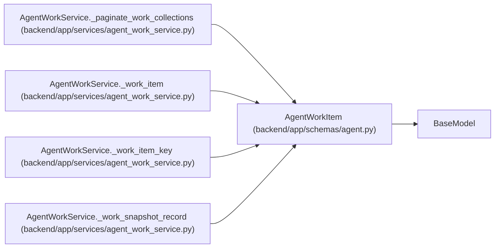

# AgentWorkItem

**Location:** `backend/app/schemas/agent.py:786`
**Kind:** Pydantic model
**Bases:** `BaseModel`
**Module:** [schemas_agent](../modules/schemas_agent.md)

## Description

One ordered assigned-work item.

## Attributes

| Name | Type | Wire name | Required | Nullable | Default | Constraints | Examples | Description |
|------|------|-----------|----------|----------|---------|-------------|-------------|----------|
| `assignment` | `AgentTaskAssignmentResponse` | `assignment` | Yes | No | — | — | — | — |
| `task` | `TaskResponse` | `task` | Yes | No | — | — | — | — |
| `queue_position` | `int` | `queue_position` | Yes | No | — | — | — | — |
| `selection_key` | `list[Any]` | `selection_key` | No | No | factory: `list` | — | — | — |
| `selection_reason` | `str` | `selection_reason` | Yes | No | — | — | — | — |
| `blocker_codes` | `list[str]` | `blocker_codes` | No | No | factory: `list` | — | — | — |
| `claim` | `Optional[dict[str, Any]]` | `claim` | No | Yes | `None` | — | — | — |
| `run` | `Optional[AgentRunResponse]` | `run` | No | Yes | `None` | — | — | — |

## Methods

*No public methods. Inherits from base classes.*

## Relationships

<!-- Auto-generated relationship summary. Do not edit by hand. -->

### Summary

| Module | Methods | Attributes |
|---|---:|---|
| [schemas_agent](../modules/schemas_agent.md) | 0 | `assignment`, `blocker_codes`, `claim`, `queue_position`, `run`, `selection_key`, `selection_reason`, `task` |

### Structure

| Kind | Entity | Module |
|---|---|---|
| Base | `BaseModel` | — |

### References

| Reference | Kind | Source | Call sites |
|---|---|---|---:|
| `AgentWorkService._paginate_work_collections` | type_reference | [agent_work_service](../modules/agent_work_service.md) | — |
| `AgentWorkService._work_item` | call | [agent_work_service](../modules/agent_work_service.md) | 1 |
| `AgentWorkService._work_item` | type_reference | [agent_work_service](../modules/agent_work_service.md) | — |
| `AgentWorkService._work_item_key` | type_reference | [agent_work_service](../modules/agent_work_service.md) | — |
| `AgentWorkService._work_snapshot_record` | type_reference | [agent_work_service](../modules/agent_work_service.md) | — |
