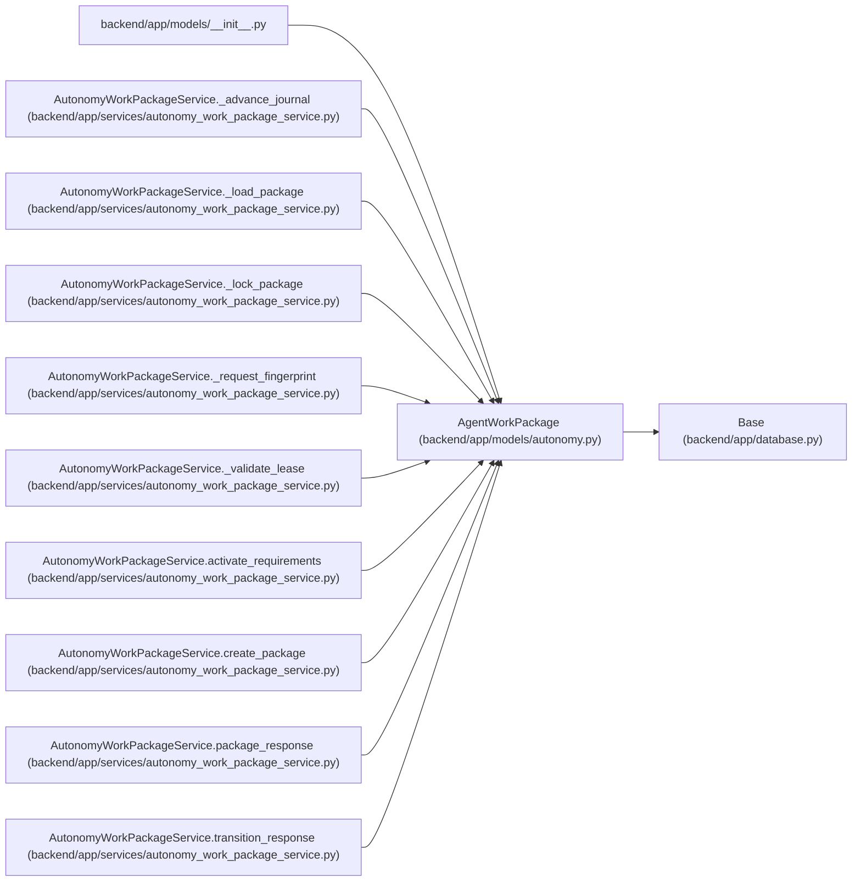

# AgentWorkPackage

**Location:** `backend/app/models/autonomy.py:128`
**Kind:** Class
**Bases:** `Base`
**Module:** [models_autonomy](../modules/models_autonomy.md)

## Description

Package aggregation is separate from the mutable execution task.

Packages associated with canonical tasks capture task/brief/artifact revisions and the brief digest. These pins complement the existing trusted artifact, lease, evaluator and verifier-independence requirements; ordinary task review cannot substitute for package verification.

## Attributes

| Name | Type | Default | Description |
|------|------|---------|-------------|
| `id` | `Mapped[int]` | `mapped_column(Integer, primary_key=True, autoincrement=True)` | — |
| `package_key` | `Mapped[str]` | `mapped_column(String(255), nullable=False)` | — |
| `package_version` | `Mapped[int]` | `mapped_column(Integer, nullable=False)` | — |
| `execution_task_id` | `Mapped[Optional[int]]` | `mapped_column(Integer, ForeignKey('tasks.id', ondelete='RESTRICT'), nullable=True, index=True)` | — |
| `task_context_version` | `Mapped[int \| None]` | `mapped_column(Integer)` | — |
| `task_brief_revision` | `Mapped[int \| None]` | `mapped_column(Integer)` | — |
| `task_artifact_revision` | `Mapped[int \| None]` | `mapped_column(Integer)` | — |
| `task_brief_digest` | `Mapped[str \| None]` | `mapped_column(String(64))` | — |
| `predecessor_package_id` | `Mapped[Optional[int]]` | `mapped_column(Integer, ForeignKey('agent_work_packages.id', ondelete='RESTRICT'), nullable=True)` | — |
| `state` | `Mapped[str]` | `mapped_column(String(30), default='planned', nullable=False)` | — |
| `artifact_set_digest` | `Mapped[str]` | `mapped_column(String(64), nullable=False)` | — |
| `contract_manifest_digest` | `Mapped[str]` | `mapped_column(String(64), nullable=False)` | — |
| `source_contract_digest` | `Mapped[str]` | `mapped_column(String(64), nullable=False)` | — |
| `creation_request_digest` | `Mapped[str]` | `mapped_column(String(64), nullable=False)` | — |
| `external_journal_revision` | `Mapped[int]` | `mapped_column(Integer, default=0, nullable=False)` | — |
| `external_journal_head_digest` | `Mapped[str]` | `mapped_column(String(64), default='0' * 64, nullable=False)` | — |
| `created_at` | `Mapped[datetime]` | `mapped_column(UTCDateTime(), default=utc_now, nullable=False)` | — |
| `updated_at` | `Mapped[datetime]` | `mapped_column(UTCDateTime(), default=utc_now, onupdate=utc_now, nullable=False)` | — |
| `requirements` | `Mapped[list['AgentVerificationRequirement']]` | `relationship('AgentVerificationRequirement', back_populates='package', passive_deletes=True)` | — |

## Methods

*No public methods. Inherits from base classes.*

## Relationships

<!-- Auto-generated relationship summary. Do not edit by hand. -->

### Summary

| Module | Methods | Attributes |
|---|---:|---|
| [models_autonomy](../modules/models_autonomy.md) | 0 | `artifact_set_digest`, `contract_manifest_digest`, `created_at`, `creation_request_digest`, `execution_task_id`, `external_journal_head_digest`, `external_journal_revision`, `id`, `package_key`, `package_version`, `predecessor_package_id`, `requirements` |

### Structure

| Kind | Entity | Module |
|---|---|---|
| Base | `Base` | [app_database](../modules/app_database.md) |

### References

| Reference | Kind | Source | Call sites |
|---|---|---|---:|
| `__init__` | import | [models___init__](../modules/models___init__.md) | — |
| `AutonomyWorkPackageService._advance_journal` | type_reference | [autonomy_work_package_service](../modules/autonomy_work_package_service.md) | — |
| `AutonomyWorkPackageService._load_package` | type_reference | [autonomy_work_package_service](../modules/autonomy_work_package_service.md) | — |
| `AutonomyWorkPackageService._lock_package` | type_reference | [autonomy_work_package_service](../modules/autonomy_work_package_service.md) | — |
| `AutonomyWorkPackageService._request_fingerprint` | type_reference | [autonomy_work_package_service](../modules/autonomy_work_package_service.md) | — |
| `AutonomyWorkPackageService._validate_lease` | type_reference | [autonomy_work_package_service](../modules/autonomy_work_package_service.md) | — |
| `AutonomyWorkPackageService.activate_requirements` | type_reference | [autonomy_work_package_service](../modules/autonomy_work_package_service.md) | — |
| `AutonomyWorkPackageService.create_package` | call | [autonomy_work_package_service](../modules/autonomy_work_package_service.md) | 1 |
| `AutonomyWorkPackageService.create_package` | type_reference | [autonomy_work_package_service](../modules/autonomy_work_package_service.md) | — |
| `AutonomyWorkPackageService.package_response` | type_reference | [autonomy_work_package_service](../modules/autonomy_work_package_service.md) | — |
| `AutonomyWorkPackageService.transition_response` | type_reference | [autonomy_work_package_service](../modules/autonomy_work_package_service.md) | — |
