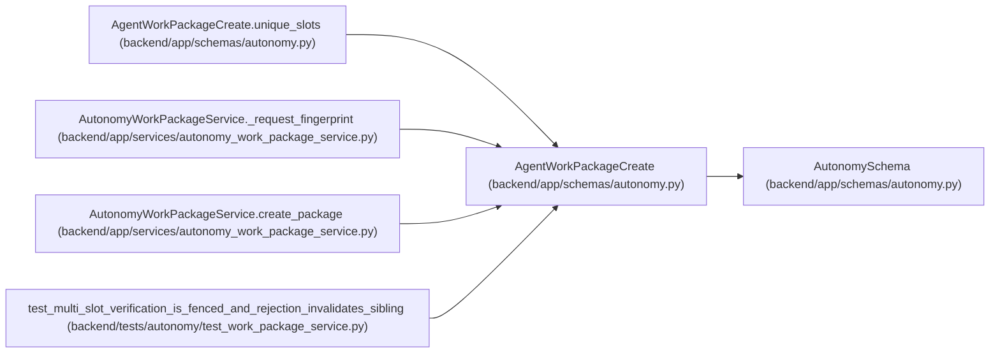

# AgentWorkPackageCreate

**Location:** `backend/app/schemas/autonomy.py:34`
**Kind:** Pydantic model
**Bases:** `AutonomySchema`
**Module:** [schemas_autonomy](../modules/schemas_autonomy.md)

## Description

_Auto-generated from `AgentWorkPackageCreate` in `backend/app/schemas/autonomy.py`._

## Validators

| Method | Scope | Fields | Mode | Options |
|--------|-------|--------|------|---------|
| `unique_slots` | model | — | after | — |

## Attributes

| Name | Type | Wire name | Required | Nullable | Default | Constraints | Examples | Description |
|------|------|-----------|----------|----------|---------|-------------|-------------|----------|
| `package_key` | `str` | `package_key` | Yes | No | — | pattern=unknown (IDENTIFIER_PATTERN) | — | — |
| `package_version` | `int` | `package_version` | Yes | No | — | ge=1 | — | — |
| `execution_task_id` | `int \| None` | `execution_task_id` | No | Yes | `None` | ge=1 | — | — |
| `predecessor_package_id` | `int \| None` | `predecessor_package_id` | No | Yes | `None` | ge=1 | — | — |
| `artifact_set_digest` | `str` | `artifact_set_digest` | Yes | No | — | pattern=unknown (SHA256_PATTERN) | — | — |
| `contract_manifest_digest` | `str` | `contract_manifest_digest` | Yes | No | — | pattern=unknown (SHA256_PATTERN) | — | — |
| `source_contract_digest` | `str` | `source_contract_digest` | Yes | No | — | pattern=unknown (SHA256_PATTERN) | — | — |
| `external_journal_revision` | `int` | `external_journal_revision` | Yes | No | — | ge=1 | — | — |
| `external_journal_head_digest` | `str` | `external_journal_head_digest` | Yes | No | — | pattern=unknown (SHA256_PATTERN) | — | — |
| `requirements` | `tuple[VerificationRequirementCreate, ...]` | `requirements` | Yes | No | — | min_length=1; max_length=64 | — | — |

## Methods

| Method | Signature | Decorators | Description |
|--------|-----------|------------|-------------|
| `unique_slots` | `() -> 'AgentWorkPackageCreate'` | `@model_validator(mode='after')` | — |

## Relationships

<!-- Auto-generated relationship summary. Do not edit by hand. -->

### Summary

| Module | Methods | Attributes |
|---|---:|---|
| [schemas_autonomy](../modules/schemas_autonomy.md) | 1 | `artifact_set_digest`, `contract_manifest_digest`, `execution_task_id`, `external_journal_head_digest`, `external_journal_revision`, `package_key`, `package_version`, `predecessor_package_id`, `requirements`, `source_contract_digest` |

### Structure

| Kind | Entity | Module |
|---|---|---|
| Base | `AutonomySchema` | [schemas_autonomy](../modules/schemas_autonomy.md) |

### References

| Reference | Kind | Source | Call sites |
|---|---|---|---:|
| `AgentWorkPackageCreate.unique_slots` | type_reference | [schemas_autonomy](../modules/schemas_autonomy.md) | — |
| `AutonomyWorkPackageService._request_fingerprint` | type_reference | [autonomy_work_package_service](../modules/autonomy_work_package_service.md) | — |
| `AutonomyWorkPackageService.create_package` | type_reference | [autonomy_work_package_service](../modules/autonomy_work_package_service.md) | — |
| `test_multi_slot_verification_is_fenced_and_rejection_invalidates_sibling` | call | [test_work_package_service](../modules/test_work_package_service.md) | 1 |
