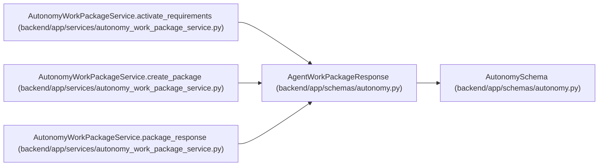

# AgentWorkPackageResponse

**Location:** `backend/app/schemas/autonomy.py:166`
**Kind:** Pydantic model
**Bases:** `AutonomySchema`
**Module:** [schemas_autonomy](../modules/schemas_autonomy.md)

## Description

_Auto-generated from `AgentWorkPackageResponse` in `backend/app/schemas/autonomy.py`._

## Model Configuration

| Setting | Value | Source |
|---------|-------|--------|
| `from_attributes` | `True` | model_config |
| `extra` | `'forbid'` | model_config |

## Attributes

| Name | Type | Wire name | Required | Nullable | Default | Constraints | Examples | Description |
|------|------|-----------|----------|----------|---------|-------------|-------------|----------|
| `task_context_version` | `int \| None` | `task_context_version` | No | Yes | `None` | — | — | — |
| `task_brief_revision` | `int \| None` | `task_brief_revision` | No | Yes | `None` | — | — | — |
| `task_artifact_revision` | `int \| None` | `task_artifact_revision` | No | Yes | `None` | — | — | — |
| `task_brief_digest` | `str \| None` | `task_brief_digest` | No | Yes | `None` | — | — | — |
| `id` | `int` | `id` | Yes | No | — | — | — | — |
| `package_key` | `str` | `package_key` | Yes | No | — | — | — | — |
| `package_version` | `int` | `package_version` | Yes | No | — | — | — | — |
| `execution_task_id` | `int \| None` | `execution_task_id` | Yes | Yes | — | — | — | — |
| `predecessor_package_id` | `int \| None` | `predecessor_package_id` | Yes | Yes | — | — | — | — |
| `state` | `str` | `state` | Yes | No | — | — | — | — |
| `artifact_set_digest` | `str` | `artifact_set_digest` | Yes | No | — | — | — | — |
| `contract_manifest_digest` | `str` | `contract_manifest_digest` | Yes | No | — | — | — | — |
| `source_contract_digest` | `str` | `source_contract_digest` | Yes | No | — | — | — | — |
| `external_journal_revision` | `int` | `external_journal_revision` | Yes | No | — | — | — | — |
| `external_journal_head_digest` | `str` | `external_journal_head_digest` | Yes | No | — | — | — | — |
| `created_at` | `datetime` | `created_at` | Yes | No | — | — | — | — |
| `updated_at` | `datetime` | `updated_at` | Yes | No | — | — | — | — |
| `requirements` | `list[VerificationRequirementResponse]` | `requirements` | Yes | No | — | max_length=64 | — | — |

## Methods

*No public methods. Inherits from base classes.*

## Relationships

<!-- Auto-generated relationship summary. Do not edit by hand. -->

### Summary

| Module | Methods | Attributes |
|---|---:|---|
| [schemas_autonomy](../modules/schemas_autonomy.md) | 0 | `artifact_set_digest`, `contract_manifest_digest`, `created_at`, `execution_task_id`, `external_journal_head_digest`, `external_journal_revision`, `id`, `package_key`, `package_version`, `predecessor_package_id`, `requirements`, `source_contract_digest` |

### Structure

| Kind | Entity | Module |
|---|---|---|
| Base | `AutonomySchema` | [schemas_autonomy](../modules/schemas_autonomy.md) |

### References

| Reference | Kind | Source | Call sites |
|---|---|---|---:|
| `AutonomyWorkPackageService.activate_requirements` | type_reference | [autonomy_work_package_service](../modules/autonomy_work_package_service.md) | — |
| `AutonomyWorkPackageService.create_package` | type_reference | [autonomy_work_package_service](../modules/autonomy_work_package_service.md) | — |
| `AutonomyWorkPackageService.package_response` | call | [autonomy_work_package_service](../modules/autonomy_work_package_service.md) | 1 |
| `AutonomyWorkPackageService.package_response` | type_reference | [autonomy_work_package_service](../modules/autonomy_work_package_service.md) | — |
