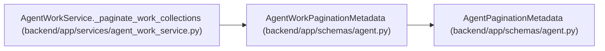

# AgentWorkPaginationMetadata

**Location:** `backend/app/schemas/agent.py:800`
**Kind:** Pydantic model
**Bases:** `AgentPaginationMetadata`
**Module:** [schemas_agent](../modules/schemas_agent.md)

## Description

Pagination metadata for ready and blocked assigned-work collections.

## Attributes

| Name | Type | Wire name | Required | Nullable | Default | Constraints | Examples | Description |
|------|------|-----------|----------|----------|---------|-------------|-------------|----------|
| `queue` | `AgentCollectionPageMetadata` | `queue` | Yes | No | — | — | — | — |
| `blocked_assigned` | `AgentCollectionPageMetadata` | `blocked_assigned` | Yes | No | — | — | — | — |

## Methods

*No public methods. Inherits from base classes.*

## Relationships

<!-- Auto-generated relationship summary. Do not edit by hand. -->

### Summary

| Module | Methods | Attributes |
|---|---:|---|
| [schemas_agent](../modules/schemas_agent.md) | 0 | `blocked_assigned`, `queue` |

### Structure

| Kind | Entity | Module |
|---|---|---|
| Base | `AgentPaginationMetadata` | [schemas_agent](../modules/schemas_agent.md) |

### References

| Reference | Kind | Source | Call sites |
|---|---|---|---:|
| `AgentWorkService._paginate_work_collections` | call | [agent_work_service](../modules/agent_work_service.md) | 1 |
| `AgentWorkService._paginate_work_collections` | type_reference | [agent_work_service](../modules/agent_work_service.md) | — |
