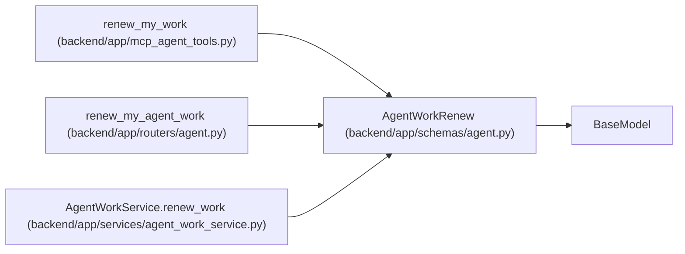

# AgentWorkRenew

**Location:** `backend/app/schemas/agent.py:912`
**Kind:** Pydantic model
**Bases:** `BaseModel`
**Module:** [schemas_agent](../modules/schemas_agent.md)

## Description

Renew the live fence for one accepted assignment and running run.

## Model Configuration

| Setting | Value | Source |
|---------|-------|--------|
| `extra` | `'forbid'` | model_config |

## Attributes

| Name | Type | Wire name | Required | Nullable | Default | Constraints | Examples | Description |
|------|------|-----------|----------|----------|---------|-------------|-------------|----------|
| `assignment_id` | `int` | `assignment_id` | Yes | No | — | — | — | — |
| `run_id` | `int` | `run_id` | Yes | No | — | — | — | — |
| `claim_id` | `str` | `claim_id` | Yes | No | — | min_length=16; max_length=64 | — | — |
| `claim_generation` | `int` | `claim_generation` | Yes | No | — | ge=1 | — | — |
| `expected_task_version` | `int` | `expected_task_version` | Yes | No | — | ge=1 | — | — |
| `lease_seconds` | `int` | `lease_seconds` | No | No | `3600` | ge=60; le=86400 | — | — |

## Methods

*No public methods. Inherits from base classes.*

## Relationships

<!-- Auto-generated relationship summary. Do not edit by hand. -->

### Summary

| Module | Methods | Attributes |
|---|---:|---|
| [schemas_agent](../modules/schemas_agent.md) | 0 | `assignment_id`, `claim_generation`, `claim_id`, `expected_task_version`, `lease_seconds`, `run_id` |

### Structure

| Kind | Entity | Module |
|---|---|---|
| Base | `BaseModel` | — |

### References

| Reference | Kind | Source | Call sites |
|---|---|---|---:|
| `renew_my_work` | call | [mcp_agent_tools](../modules/mcp_agent_tools.md) | 1 |
| `renew_my_agent_work` | type_reference | [routers_agent](../modules/routers_agent.md) | — |
| `AgentWorkService.renew_work` | type_reference | [agent_work_service](../modules/agent_work_service.md) | — |
