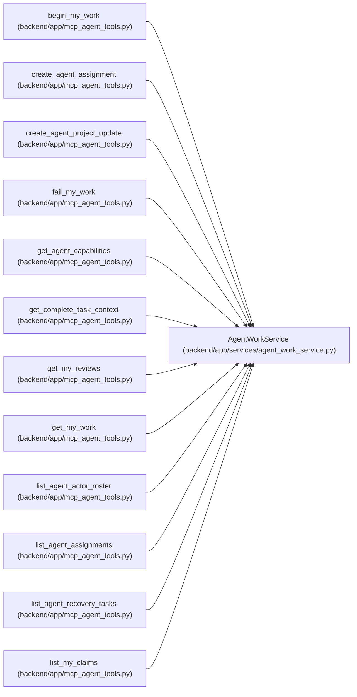

# AgentWorkService

**Location:** `backend/app/services/agent_work_service.py:171`
**Kind:** Class
**Bases:** —
**Module:** [agent_work_service](../modules/agent_work_service.md)

## Description

Coordinate PM dispatch and low-freedom worker lifecycle commands.

## Attributes

*No annotated attributes found.*

## Methods

| Method | Signature | Decorators | Description |
|--------|-----------|------------|-------------|
| `__init__` | `(db: AsyncSession, *, rollout_service: AgentRoutingRolloutService \| None = None)` | — | — |
| `_resolve_rollout` | *(async)* `(actor: AgentActor) -> AgentRoutingRolloutService` | — | — |
| `_require_enforced_rollout` | `(rollout_service: AgentRoutingRolloutService)` | `@staticmethod` | Require effective enforcement and return its bounded status. |
| `_require_enforced_routing` | `()` | — | Preserve the explicit/static rollout guard for compatibility. |
| `_require_enforced_routing_for_actor` | *(async)* `(actor: AgentActor)` | — | Require enforcement using the actor's authoritative topology. |
| `_require_supervised_rollout` | `(rollout_service: AgentRoutingRolloutService)` | `@staticmethod` | Permit legacy/supervised dispatch only while enforcement is inactive. |
| `_require_supervised_routing` | `()` | — | Preserve the explicit/static rollout guard for compatibility. |
| `_require_supervised_routing_for_actor` | *(async)* `(actor: AgentActor)` | — | Require supervised mode using the actor's authoritative topology. |
| `_require_team_dispatch_member` | *(async)* `(principal: AgentActor, target_actor_id: int) -> None` | — | — |
| `_audited_command_request` | `(data: Any, *, idempotency_key: str, rationale: str, correlation_id: str, exclude_unset: bool = False) -> tuple[AgentPlanningCommandContext, dict[str, Any]]` | `@staticmethod` | Validate PM audit metadata and bind it into the exact request hash. |
| `_require_any_scope` | `(actor: AgentActor, *scopes: str) -> None` | `@staticmethod` | — |
| `actor_response` | `(actor: AgentActor) -> AgentActorResponse` | `@staticmethod` | — |
| `assignment_response` | `(assignment: AgentTaskAssignment, *, model_binding: AgentModelBinding \| None = None, binding_loaded: bool = False) -> AgentTaskAssignmentResponse` | `@staticmethod` | — |
| `_serialize_routing_snapshot` | `(snapshot: dict[str, Any]) -> str` | `@staticmethod` | Use the same bounded canonical encoding validated by the schema. |
| `_routing_snapshot` | `(assignment: AgentTaskAssignment) -> dict[str, Any]` | `@staticmethod` | — |
| `_record_routing_selection` | *(async)* `(*, assignment: AgentTaskAssignment, routing_validation: Any, principal: AgentActor, correlation_id: str, idempotency_key: str) -> None` | — | Stage bounded selection and governed escalation evidence. |
| `_record_routing_stale_conflict` | *(async)* `(*, task: Task, principal: AgentActor, data: Any, conflict: Any, assignment_id: int \| None = None, correlation_id: str \| None = None) -> None` | — | Durably record a failed selection attempt without mutating work state. |
| `_selection_pending` | `(assignment: AgentTaskAssignment) -> bool` | `@classmethod` | — |
| `_is_model_aware_assignment` | `(assignment: AgentTaskAssignment) -> bool` | `@classmethod` | — |
| `_failure_category` | `(evidence: Any) -> str` | `@staticmethod` | Recognize only explicit governed model-failure evidence. |
| `_routing_lineage_snapshot` | `(*, task: Task, source_assignments: Iterable[AgentTaskAssignment], transition: str, provisional_actor_id: int, reason: str, evidence: Any = None) -> dict[str, Any]` | `@classmethod` | Build bounded pending-selection evidence without copying opaque payloads. |
| `run_response` | `(run: AgentRun) -> AgentRunResponse` | `@staticmethod` | — |
| `_profile_roster_response` | `(profile: TeamMemberProfile) -> AgentActorRosterProfile` | `@staticmethod` | — |
| `list_actor_roster` | *(async)* `(actor: AgentActor, *, include_disabled: bool = False) -> list[AgentActorRosterItem]` | — | Return bounded exact-actor/profile/binding evidence without key material. |
| `_assignment_count` | *(async)* `(actor_id: int, state: str) -> int` | — | — |
| `_assignment_lock_hint` | *(async)* `(assignment_id: int) -> Optional[tuple[int, int]]` | — | Read immutable lock-routing keys before taking canonical row locks. |
| `_lock_task` | *(async)* `(task_id: int) -> Optional[Task]` | — | Lock a task first and then load its complete response relationships. |
| `_lock_actors` | *(async)* `(actor_ids: Iterable[int]) -> dict[int, AgentActor]` | — | Lock actor rows in primary-key order, refreshing identity-map state. |
| `_lock_task_assignments` | *(async)* `(task_id: int, *, states: Optional[Iterable[str]] = None) -> list[AgentTaskAssignment]` | — | Lock a task's selected assignment rows in primary-key order. |
| `_lock_task_runs` | *(async)* `(task_id: int, *, run_ids: Optional[Iterable[int]] = None, status: Optional[str] = None) -> list[AgentRun]` | — | Lock selected run rows last and in primary-key order. |
| `_has_pending_recovery_signal` | *(async)* `(task_id: int) -> bool` | — | Return whether the latest agent lifecycle evidence still needs ownership. |
| `_validate_assignment_actor` | `(actor: AgentActor, purpose: str) -> None` | `@staticmethod` | Require authority before separate profile/model compatibility evidence. |
| `_validate_assignment_context` | *(async)* `(task: Task, *, team_member_id: Optional[int], reviewer_profile_id: Optional[int]) -> None` | — | Validate optional capacity and reviewer references against live records. |
| `list_assignments` | *(async)* `(principal: AgentActor, *, task_id: Optional[int] = None, actor_id: Optional[int] = None, purpose: Optional[str] = None, state: Optional[str] = None, limit: int = 200) -> list[AgentTaskAssignmentResponse]` | — | Return a secret-free durable assignment projection for restart-safe reads. |
| `create_assignment` | *(async)* `(principal: AgentActor, data: AgentTaskAssignmentCreate \| ModelAwareAgentTaskAssignmentCreate, *, idempotency_key: Optional[str] = None, rationale: str, correlation_id: str) -> AgentTaskAssignmentResponse` | `@atomic_command` | Dispatch one task to one provisioned actor. |
| `update_assignment` | *(async)* `(assignment_id: int, principal: AgentActor, data: AgentTaskAssignmentUpdate \| ModelAwareAgentTaskAssignmentUpdate, *, idempotency_key: Optional[str] = None, rationale: str, correlation_id: str) -> AgentTaskAssignmentResponse` | `@atomic_command` | Reassign, reorder, or cancel queued work. |
| `get_work` | *(async)* `(actor: AgentActor, *, limit: int = 20, cursor: Optional[str] = None) -> AgentWorkDecisionResponse` | — | Return the authoritative resume/begin/wait/recovery decision. |
| `get_reviews` | *(async)* `(actor: AgentActor, *, limit: int = 50, cursor: Optional[str] = None) -> AgentReviewQueueResponse` | — | Return the separate verifier-assignment queue. |
| `get_task_context` | *(async)* `(actor: AgentActor, task_id: int, *, assignment_id: Optional[int] = None) -> AgentTaskContextResponse` | — | Return complete worker context with brief and dependency states. |
| `begin` | *(async)* `(actor: AgentActor, data: AgentWorkBegin \| ModelAwareAgentWorkBegin, *, idempotency_key: str) -> AgentWorkBeginResponse` | `@atomic_command` | Atomically accept, fence, claim, run, and activate selected work. |
| `submit` | *(async)* `(actor: AgentActor, data: AgentWorkSubmit, *, idempotency_key: str) -> AgentWorkTerminalResponse` | `@atomic_command` | Atomically finish, resolve, fulfill, and release assigned work. |
| `renew_work` | *(async)* `(actor: AgentActor, data: AgentWorkRenew, *, idempotency_key: str) -> AgentWorkBeginResponse` | `@atomic_command` | Atomically renew an accepted assignment's live claim and heartbeat. |
| `fail` | *(async)* `(actor: AgentActor, data: AgentWorkTerminal, *, idempotency_key: str) -> AgentWorkTerminalResponse` | `@atomic_command` | Atomically finish failure, release the fence, and signal recovery. |
| `_terminal_work` | *(async)* `(actor: AgentActor, data: AgentWorkSubmit \| AgentWorkTerminal, *, idempotency_key: str, success: bool) -> AgentWorkTerminalResponse` | — | — |
| `review` | *(async)* `(actor: AgentActor, data: AgentReviewVerdict, *, idempotency_key: str, rationale: str, correlation_id: str) -> AgentReviewVerdictResponse` | `@atomic_command` | Apply an independent verification verdict and optional rework handback. |
| `list_my_claims` | *(async)* `(actor: AgentActor) -> list[dict[str, Any]]` | — | Return current claims owned by an actor. |
| `list_my_runs` | *(async)* `(actor: AgentActor, *, limit: int = 50) -> list[AgentRunResponse]` | — | Return recent runs owned by an actor. |
| `list_recovery_tasks` | *(async)* `(actor: AgentActor, *, limit: int = 50, cursor: Optional[str] = None) -> AgentRecoveryListResponse` | — | Return typed active/resolved recovery diagnoses and ownership tuples. |
| `requeue_recovery` | *(async)* `(principal: AgentActor, task_id: int, data: AgentRecoveryRequeue, *, idempotency_key: str, rationale: str, correlation_id: str) -> AgentRecoveryRequeueResponse` | `@atomic_command` | Cancel stale ownership and create one ordered recovery assignment. |
| `create_project_update` | *(async)* `(actor: AgentActor, project_id: int, data: AgentProjectUpdateCreate, *, idempotency_key: str, rationale: str, correlation_id: str) -> AgentProjectUpdateResponse` | `@atomic_command` | Append one evidence-backed project update with agent attribution. |
| `report_discovery` | *(async)* `(actor: AgentActor, data: AgentDiscoveryTriageCreate, *, idempotency_key: str) -> AgentDiscoveryTriageResponse` | `@atomic_command` | Create one claim-bound discovery Triage item without expanding scope. |
| `_definition_blockers` | `(task: Task) -> list[str]` | — | — |
| `_start_blockers` | *(async)* `(task: Task, assignment: Optional[AgentTaskAssignment], now: datetime) -> list[str]` | — | — |
| `_work_item` | *(async)* `(assignment: AgentTaskAssignment, position: int, now: datetime, *, running: Optional[Iterable[AgentRun]] = None) -> AgentWorkItem` | — | — |
| `_current_recovery_codes` | *(async)* `(actor: AgentActor, accepted: list[AgentTaskAssignment], running: list[AgentRun], now: datetime) -> list[str]` | — | — |
| `_validate_fence` | `(task: Task, actor: AgentActor, claim_id: str, claim_generation: int) -> None` | `@staticmethod` | — |
| `_idempotent_replay` | *(async)* `(actor: AgentActor, operation: str, target_type: str, target_id: int, idempotency_key: Optional[str], request_payload: dict[str, Any]) -> Optional[dict[str, Any]]` | — | — |
| `_live_fence_receipt` | `(response: AgentWorkBeginResponse) -> dict[str, Any]` | `@staticmethod` | Store an exact live response without retaining the plaintext claim secret. |
| `_replay_live_fence_receipt` | *(async)* `(actor: AgentActor, payload: dict[str, Any]) -> AgentWorkBeginResponse` | — | Replay a fence receipt only while its original authority is still exact. |
| `_require_current_execution_policy` | `(task)` | `@staticmethod` | — |
| `_record_idempotency` | *(async)* `(actor: AgentActor, operation: str, target_type: str, target_id: int, idempotency_key: Optional[str], request_payload: dict[str, Any], response_payload: dict[str, Any]) -> None` | — | — |
| `_request_hash` | `(payload: dict[str, Any]) -> str` | `@staticmethod` | — |
| `_snapshot_revision` | `(kind: str, records: list[dict[str, Any]], *, queue_revision: Optional[int]) -> str` | `@staticmethod` | — |
| `_validate_page_limit` | `(limit: int) -> None` | `@staticmethod` | — |
| `_encode_page_cursor` | `(*, kind: str, actor_id: int, queue_revision: Optional[int], snapshot_revision: str, positions: dict[str, Optional[list[Any]]]) -> str` | `@staticmethod` | — |
| `_decode_page_cursor` | `(cursor: Optional[str], *, kind: str, actor_id: int, queue_revision: Optional[int], snapshot_revision: str) -> dict[str, Optional[list[Any]]]` | `@staticmethod` | — |
| `_keyset_page` | `(items: list[Any], *, last_key: Optional[list[Any]], limit: int, key: Callable[[Any], list[Any]]) -> tuple[list[Any], bool, Optional[list[Any]]]` | `@staticmethod` | — |
| `_work_item_key` | `(item: AgentWorkItem) -> list[Any]` | `@staticmethod` | — |
| `_recovery_item_key` | `(item: AgentRecoveryItem) -> list[Any]` | `@staticmethod` | — |
| `_work_snapshot_record` | `(bucket: str, item: AgentWorkItem) -> dict[str, Any]` | `@staticmethod` | — |
| `_recovery_snapshot_record` | `(item: AgentRecoveryItem) -> dict[str, Any]` | `@staticmethod` | — |
| `_paginate_work_collections` | `(*, actor_id: int, queue_revision: int, ready: list[AgentWorkItem], blocked: list[AgentWorkItem], limit: int, cursor: Optional[str], extra_records: Optional[list[dict[str, Any]]] = None) -> tuple[list[AgentWorkItem], list[AgentWorkItem], AgentWorkPaginationMetadata]` | — | — |
| `_paginate_single_collection` | `(*, kind: str, actor_id: int, queue_revision: Optional[int], items: list[Any], records: list[dict[str, Any]], limit: int, cursor: Optional[str], key: Callable[[Any], list[Any]]) -> tuple[list[Any], AgentPaginationMetadata]` | — | — |
| `_read_actor_queue_revision` | *(async)* `(actor_id: int) -> int` | — | — |
| `work_etag` | `(decision: AgentWorkDecisionResponse, *, cursor: Optional[str], limit: int) -> str` | `@staticmethod` | Build a weak validator for ownership-equivalent work representations. |

## Relationships

<!-- Auto-generated relationship summary. Do not edit by hand. -->

### Summary

| Module | Methods | Attributes |
|---|---:|---|
| [agent_work_service](../modules/agent_work_service.md) | 75 | — |

### References

| Reference | Kind | Source | Call sites |
|---|---|---|---:|
| `begin_my_work` | call | [mcp_agent_tools](../modules/mcp_agent_tools.md) | 1 |
| `create_agent_assignment` | call | [mcp_agent_tools](../modules/mcp_agent_tools.md) | 1 |
| `create_agent_project_update` | call | [mcp_agent_tools](../modules/mcp_agent_tools.md) | 1 |
| `fail_my_work` | call | [mcp_agent_tools](../modules/mcp_agent_tools.md) | 1 |
| `get_agent_capabilities` | call | [mcp_agent_tools](../modules/mcp_agent_tools.md) | 1 |
| `get_complete_task_context` | call | [mcp_agent_tools](../modules/mcp_agent_tools.md) | 1 |
| `get_my_reviews` | call | [mcp_agent_tools](../modules/mcp_agent_tools.md) | 1 |
| `get_my_work` | call | [mcp_agent_tools](../modules/mcp_agent_tools.md) | 1 |
| `list_agent_actor_roster` | call | [mcp_agent_tools](../modules/mcp_agent_tools.md) | 1 |
| `list_agent_assignments` | call | [mcp_agent_tools](../modules/mcp_agent_tools.md) | 1 |
| `list_agent_recovery_tasks` | call | [mcp_agent_tools](../modules/mcp_agent_tools.md) | 1 |
| `list_my_claims` | call | [mcp_agent_tools](../modules/mcp_agent_tools.md) | 1 |

> References: showing 12 of 69 logical references; 57 omitted by the 12-row generated summary limit.
