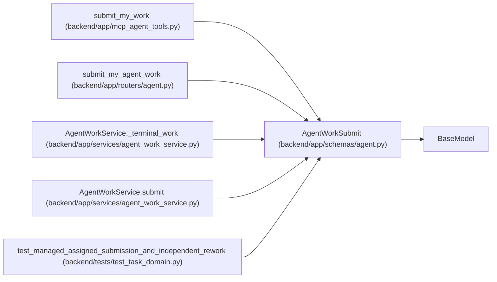

# AgentWorkSubmit

**Location:** `backend/app/schemas/agent.py:919`
**Kind:** Pydantic model
**Bases:** `BaseModel`
**Module:** [schemas_agent](../modules/schemas_agent.md)

## Description

Atomically submit an active assignment for verification.

## Model Configuration

| Setting | Value | Source |
|---------|-------|--------|
| `extra` | `'forbid'` | model_config |

## Validators

| Method | Scope | Fields | Mode | Options |
|--------|-------|--------|------|---------|
| `validate_artifact_links` | field | artifact_links | after | — |
| `validate_urls` | field | commit_url, pr_url | after | — |
| `validate_evidence_size` | field | evidence | after | — |

## Attributes

| Name | Type | Wire name | Required | Nullable | Default | Constraints | Examples | Description |
|------|------|-----------|----------|----------|---------|-------------|-------------|----------|
| `criterion_progress` | `list[CriterionProgress]` | `criterion_progress` | No | No | factory: `list` | max_length=100 | — | — |
| `assignment_id` | `int` | `assignment_id` | Yes | No | — | — | — | — |
| `run_id` | `int` | `run_id` | Yes | No | — | — | — | — |
| `claim_id` | `str` | `claim_id` | Yes | No | — | min_length=16; max_length=64 | — | — |
| `claim_generation` | `int` | `claim_generation` | Yes | No | — | ge=1 | — | — |
| `expected_task_version` | `int` | `expected_task_version` | Yes | No | — | ge=1 | — | — |
| `summary` | `str` | `summary` | Yes | No | — | min_length=1; max_length=unknown (MAX_AGENT_TEXT_LENGTH) | — | — |
| `evidence` | `dict[str, Any]` | `evidence` | Yes | No | — | min_length=1; max_length=unknown (MAX_AGENT_JSON_FIELDS) | — | — |
| `artifact_links` | `list[str]` | `artifact_links` | No | No | factory: `list` | max_length=unknown (MAX_AGENT_ARTIFACT_LINKS) | — | — |
| `commit_url` | `Optional[str]` | `commit_url` | No | Yes | `None` | max_length=1000 | — | — |
| `pr_url` | `Optional[str]` | `pr_url` | No | Yes | `None` | max_length=1000 | — | — |

## Methods

| Method | Signature | Decorators | Description |
|--------|-----------|------------|-------------|
| `validate_artifact_links` | `(value: list[str]) -> list[str]` | `@field_validator('artifact_links')`, `@classmethod` | — |
| `validate_urls` | `(value: Optional[str]) -> Optional[str]` | `@field_validator('commit_url', 'pr_url')`, `@classmethod` | — |
| `validate_evidence_size` | `(value: dict[str, Any]) -> dict[str, Any]` | `@field_validator('evidence')`, `@classmethod` | — |

## Relationships

<!-- Auto-generated relationship summary. Do not edit by hand. -->

### Summary

| Module | Methods | Attributes |
|---|---:|---|
| [schemas_agent](../modules/schemas_agent.md) | 3 | `artifact_links`, `assignment_id`, `claim_generation`, `claim_id`, `commit_url`, `criterion_progress`, `evidence`, `expected_task_version`, `pr_url`, `run_id`, `summary` |

### Structure

| Kind | Entity | Module |
|---|---|---|
| Base | `BaseModel` | — |

### References

| Reference | Kind | Source | Call sites |
|---|---|---|---:|
| `submit_my_work` | call | [mcp_agent_tools](../modules/mcp_agent_tools.md) | 1 |
| `submit_my_agent_work` | type_reference | [routers_agent](../modules/routers_agent.md) | — |
| `AgentWorkService._terminal_work` | type_reference | [agent_work_service](../modules/agent_work_service.md) | — |
| `AgentWorkService.submit` | type_reference | [agent_work_service](../modules/agent_work_service.md) | — |
| `test_managed_assigned_submission_and_independent_rework` | call | [test_task_domain](../modules/test_task_domain.md) | 1 |
