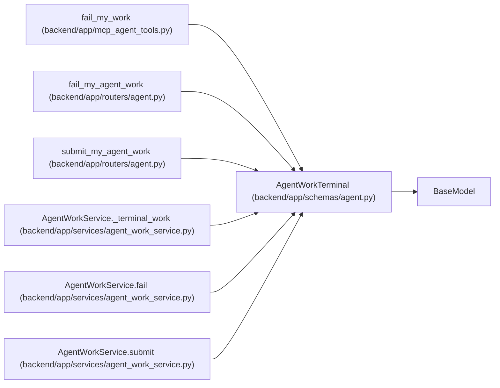

# AgentWorkTerminal

**Location:** `backend/app/schemas/agent.py:949`
**Kind:** Pydantic model
**Bases:** `BaseModel`
**Module:** [schemas_agent](../modules/schemas_agent.md)

## Description

Atomically fail or cancel an active assignment.

## Model Configuration

| Setting | Value | Source |
|---------|-------|--------|
| `extra` | `'forbid'` | model_config |

## Validators

| Method | Scope | Fields | Mode | Options |
|--------|-------|--------|------|---------|
| `validate_evidence_size` | field | evidence | after | — |

## Attributes

| Name | Type | Wire name | Required | Nullable | Default | Constraints | Examples | Description |
|------|------|-----------|----------|----------|---------|-------------|-------------|----------|
| `assignment_id` | `int` | `assignment_id` | Yes | No | — | — | — | — |
| `run_id` | `int` | `run_id` | Yes | No | — | — | — | — |
| `claim_id` | `str` | `claim_id` | Yes | No | — | max_length=64; min_length=16 | — | — |
| `claim_generation` | `int` | `claim_generation` | Yes | No | — | ge=1 | — | — |
| `expected_task_version` | `int` | `expected_task_version` | Yes | No | — | ge=1 | — | — |
| `status` | `Literal['failed', 'canceled']` | `status` | Yes | No | — | — | — | — |
| `summary` | `Optional[str]` | `summary` | No | Yes | `None` | max_length=unknown (MAX_AGENT_TEXT_LENGTH) | — | — |
| `error` | `Optional[str]` | `error` | No | Yes | `None` | max_length=unknown (MAX_AGENT_TEXT_LENGTH) | — | — |
| `evidence` | `dict[str, Any]` | `evidence` | Yes | No | — | min_length=1; max_length=unknown (MAX_AGENT_JSON_FIELDS) | — | — |

## Methods

| Method | Signature | Decorators | Description |
|--------|-----------|------------|-------------|
| `validate_evidence_size` | `(value: dict[str, Any]) -> dict[str, Any]` | `@field_validator('evidence')`, `@classmethod` | — |

## Relationships

<!-- Auto-generated relationship summary. Do not edit by hand. -->

### Summary

| Module | Methods | Attributes |
|---|---:|---|
| [schemas_agent](../modules/schemas_agent.md) | 1 | `assignment_id`, `claim_generation`, `claim_id`, `error`, `evidence`, `expected_task_version`, `run_id`, `status`, `summary` |

### Structure

| Kind | Entity | Module |
|---|---|---|
| Base | `BaseModel` | — |

### References

| Reference | Kind | Source | Call sites |
|---|---|---|---:|
| `fail_my_work` | call | [mcp_agent_tools](../modules/mcp_agent_tools.md) | 1 |
| `fail_my_agent_work` | type_reference | [routers_agent](../modules/routers_agent.md) | — |
| `submit_my_agent_work` | type_reference | [routers_agent](../modules/routers_agent.md) | — |
| `AgentWorkService._terminal_work` | type_reference | [agent_work_service](../modules/agent_work_service.md) | — |
| `AgentWorkService.fail` | type_reference | [agent_work_service](../modules/agent_work_service.md) | — |
| `AgentWorkService.submit` | type_reference | [agent_work_service](../modules/agent_work_service.md) | — |
