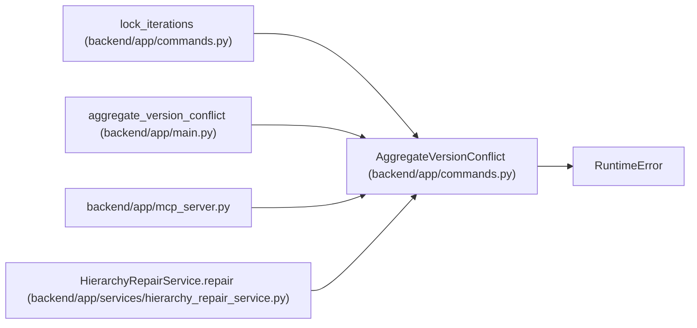

# AggregateVersionConflict

**Location:** `backend/app/commands.py:22`
**Kind:** Class
**Bases:** `RuntimeError`
**Module:** [commands](../modules/commands.md)

## Description

_Auto-generated from `AggregateVersionConflict` in `backend/app/commands.py`._

## Attributes

*No annotated attributes found.*

## Methods

| Method | Signature | Decorators | Description |
|--------|-----------|------------|-------------|
| `__init__` | `(iteration_id: int, expected: int, current: int)` | — | — |
| `detail` | `()` | — | — |

## Relationships

<!-- Auto-generated relationship summary. Do not edit by hand. -->

### Summary

| Module | Methods | Attributes |
|---|---:|---|
| [commands](../modules/commands.md) | 2 | — |

### Structure

| Kind | Entity | Module |
|---|---|---|
| Base | `RuntimeError` | — |

### References

| Reference | Kind | Source | Call sites |
|---|---|---|---:|
| `lock_iterations` | call | [commands](../modules/commands.md) | 3 |
| `aggregate_version_conflict` | type_reference | [app_main](../modules/app_main.md) | — |
| `mcp_server` | import | [mcp_server](../modules/mcp_server.md) | — |
| `HierarchyRepairService.repair` | call | [hierarchy_repair_service](../modules/hierarchy_repair_service.md) | 1 |
