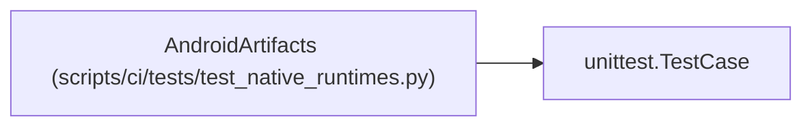

# AndroidArtifacts

**Location:** `scripts/ci/tests/test_native_runtimes.py:172`
**Kind:** Class
**Bases:** `unittest.TestCase`
**Module:** [test_native_runtimes](../modules/test_native_runtimes.md)

## Description

_Auto-generated from `AndroidArtifacts` in `scripts/ci/tests/test_native_runtimes.py`._

## Attributes

*No annotated attributes found.*

## Methods

| Method | Signature | Decorators | Description |
|--------|-----------|------------|-------------|
| `check_run` | `(*, results = True, apk = True, gradle_code = 0, skip_release = False)` | — | — |
| `test_native_gradle_keeps_results_and_apk` | `()` | — | — |
| `test_missing_outputs_and_failed_gradle_do_not_pass` | `()` | — | — |

## Relationships

<!-- Auto-generated relationship summary. Do not edit by hand. -->

### Summary

| Module | Methods | Attributes |
|---|---:|---|
| [test_native_runtimes](../modules/test_native_runtimes.md) | 3 | — |

### Structure

| Kind | Entity | Module |
|---|---|---|
| Base | `unittest.TestCase` | — |
