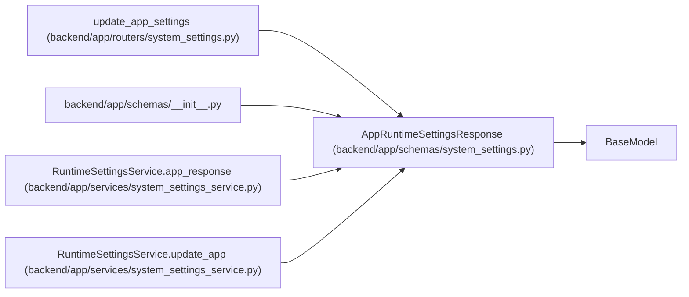

# AppRuntimeSettingsResponse

**Location:** `backend/app/schemas/system_settings.py:91`
**Kind:** Pydantic model
**Bases:** `BaseModel`
**Module:** [schemas_system_settings](../modules/schemas_system_settings.md)

## Description

Resolved app-wide language behavior.

## Attributes

| Name | Type | Wire name | Required | Nullable | Default | Constraints | Examples | Description |
|------|------|-----------|----------|----------|---------|-------------|-------------|----------|
| `ui_language` | `LanguageCode` | `ui_language` | Yes | No | — | — | — | — |
| `ai_language_mode` | `AILanguageMode` | `ai_language_mode` | Yes | No | — | — | — | — |
| `field_sources` | `dict[str, RuntimeSettingSource]` | `field_sources` | No | No | factory: `dict` | — | — | — |

## Methods

*No public methods. Inherits from base classes.*

## Relationships

<!-- Auto-generated relationship summary. Do not edit by hand. -->

### Summary

| Module | Methods | Attributes |
|---|---:|---|
| [schemas_system_settings](../modules/schemas_system_settings.md) | 0 | `ai_language_mode`, `field_sources`, `ui_language` |

### Structure

| Kind | Entity | Module |
|---|---|---|
| Base | `BaseModel` | — |

### References

| Reference | Kind | Source | Call sites |
|---|---|---|---:|
| `update_app_settings` | type_reference | [routers_system_settings](../modules/routers_system_settings.md) | — |
| `__init__` | import | [schemas___init__](../modules/schemas___init__.md) | — |
| `RuntimeSettingsService.app_response` | call | [system_settings_service](../modules/system_settings_service.md) | 1 |
| `RuntimeSettingsService.app_response` | type_reference | [system_settings_service](../modules/system_settings_service.md) | — |
| `RuntimeSettingsService.update_app` | type_reference | [system_settings_service](../modules/system_settings_service.md) | — |
