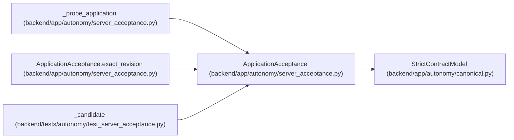

# ApplicationAcceptance

**Location:** `backend/app/autonomy/server_acceptance.py:52`
**Kind:** Pydantic model
**Bases:** `StrictContractModel`
**Module:** [autonomy_server_acceptance](../modules/autonomy_server_acceptance.md)

## Description

_Auto-generated from `ApplicationAcceptance` in `backend/app/autonomy/server_acceptance.py`._

## Validators

| Method | Scope | Fields | Mode | Options |
|--------|-------|--------|------|---------|
| `exact_revision` | model | — | after | — |

## Attributes

| Name | Type | Wire name | Required | Nullable | Default | Constraints | Examples | Description |
|------|------|-----------|----------|----------|---------|-------------|-------------|----------|
| `backend_url` | `str` | `backend_url` | Yes | No | — | pattern='^https?://[^@\\s]+$' | — | — |
| `gateway_url` | `str` | `gateway_url` | Yes | No | — | pattern='^https?://[^@\\s]+$' | — | — |
| `status` | `Literal['ready']` | `status` | Yes | No | — | — | — | — |
| `database_backend` | `Literal['postgresql']` | `database_backend` | Yes | No | — | — | — | — |
| `database_login_role` | `Literal['workchord_runtime']` | `database_login_role` | Yes | No | — | — | — | — |
| `database_connected` | `Literal[True]` | `database_connected` | No | No | `True` | — | — | — |
| `schema_current` | `Literal[True]` | `schema_current` | No | No | `True` | — | — | — |
| `migration_gate_clear` | `Literal[True]` | `migration_gate_clear` | No | No | `True` | — | — | — |
| `current_revision` | `str` | `current_revision` | Yes | No | — | pattern=unknown (IDENTIFIER_PATTERN) | — | — |
| `expected_revision` | `str` | `expected_revision` | Yes | No | — | pattern=unknown (IDENTIFIER_PATTERN) | — | — |
| `backend_source_revision` | `str` | `backend_source_revision` | Yes | No | — | pattern=unknown (REVISION_PATTERN) | — | — |
| `gateway_source_revision` | `str` | `gateway_source_revision` | Yes | No | — | pattern=unknown (REVISION_PATTERN) | — | — |
| `backend_artifact_digest` | `str` | `backend_artifact_digest` | Yes | No | — | pattern=unknown (SHA256_PATTERN) | — | — |
| `gateway_artifact_digest` | `str` | `gateway_artifact_digest` | Yes | No | — | pattern=unknown (SHA256_PATTERN) | — | — |
| `expected_gateway_artifact_digest` | `str` | `expected_gateway_artifact_digest` | Yes | No | — | pattern=unknown (SHA256_PATTERN) | — | — |
| `backend_contract_manifest_digest` | `str` | `backend_contract_manifest_digest` | Yes | No | — | pattern=unknown (SHA256_PATTERN) | — | — |

## Methods

| Method | Signature | Decorators | Description |
|--------|-----------|------------|-------------|
| `exact_revision` | `() -> 'ApplicationAcceptance'` | `@model_validator(mode='after')` | — |

## Relationships

<!-- Auto-generated relationship summary. Do not edit by hand. -->

### Summary

| Module | Methods | Attributes |
|---|---:|---|
| [autonomy_server_acceptance](../modules/autonomy_server_acceptance.md) | 1 | `backend_artifact_digest`, `backend_contract_manifest_digest`, `backend_source_revision`, `backend_url`, `current_revision`, `database_backend`, `database_connected`, `database_login_role`, `expected_gateway_artifact_digest`, `expected_revision`, `gateway_artifact_digest`, `gateway_source_revision` |

### Structure

| Kind | Entity | Module |
|---|---|---|
| Base | `StrictContractModel` | [autonomy_canonical](../modules/autonomy_canonical.md) |

### References

| Reference | Kind | Source | Call sites |
|---|---|---|---:|
| `_probe_application` | call | [autonomy_server_acceptance](../modules/autonomy_server_acceptance.md) | 1 |
| `_probe_application` | type_reference | [autonomy_server_acceptance](../modules/autonomy_server_acceptance.md) | — |
| `ApplicationAcceptance.exact_revision` | type_reference | [autonomy_server_acceptance](../modules/autonomy_server_acceptance.md) | — |
| `_candidate` | call | [test_server_acceptance](../modules/test_server_acceptance.md) | 1 |
