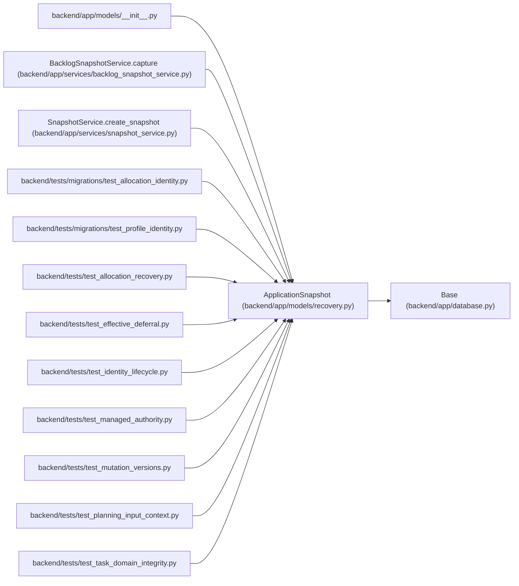

# ApplicationSnapshot

**Location:** `backend/app/models/recovery.py:12`
**Kind:** Class
**Bases:** `Base`
**Module:** [recovery](../modules/recovery.md)

## Description

_Auto-generated from `ApplicationSnapshot` in `backend/app/models/recovery.py`._

Checksummed application recovery data belongs to an iteration or a project backlog. Capture and retention share the mutation transaction. This record is not a full database backup.

## Attributes

| Name | Type | Default | Description |
|------|------|---------|-------------|
| `id` | `Mapped[int]` | `mapped_column(Integer, primary_key=True)` | — |
| `iteration_id` | `Mapped[int \| None]` | `mapped_column(ForeignKey('iterations.id', ondelete='CASCADE'), index=True)` | — |
| `project_id` | `Mapped[int \| None]` | `mapped_column(ForeignKey('projects.id', ondelete='CASCADE'), index=True)` | — |
| `filename` | `Mapped[str]` | `mapped_column(String(255), nullable=False)` | — |
| `schema_version` | `Mapped[int]` | `mapped_column(Integer, default=1, nullable=False)` | — |
| `input_revision` | `Mapped[int]` | `mapped_column(Integer, nullable=False)` | — |
| `payload` | `Mapped[dict]` | `mapped_column(JSON, nullable=False)` | — |
| `checksum` | `Mapped[str]` | `mapped_column(String(64), nullable=False)` | — |
| `provenance` | `Mapped[str]` | `mapped_column(String(32), default='command', nullable=False)` | — |
| `created_by_principal_id` | `Mapped[int \| None]` | `mapped_column(ForeignKey('principals.id', ondelete='RESTRICT'))` | — |
| `created_at` | `Mapped[datetime]` | `mapped_column(UTCDateTime(), default=utc_now, index=True)` | — |

## Methods

*No public methods. Inherits from base classes.*

## Relationships

<!-- Auto-generated relationship summary. Do not edit by hand. -->

### Summary

| Module | Methods | Attributes |
|---|---:|---|
| [recovery](../modules/recovery.md) | 0 | `checksum`, `created_at`, `created_by_principal_id`, `filename`, `id`, `input_revision`, `iteration_id`, `payload`, `project_id`, `provenance`, `schema_version` |

### Structure

| Kind | Entity | Module |
|---|---|---|
| Base | `Base` | [app_database](../modules/app_database.md) |

### References

| Reference | Kind | Source | Call sites |
|---|---|---|---:|
| `__init__` | import | [models___init__](../modules/models___init__.md) | — |
| `BacklogSnapshotService.capture` | call | [backlog_snapshot_service](../modules/backlog_snapshot_service.md) | 1 |
| `SnapshotService.create_snapshot` | call | [snapshot_service](../modules/snapshot_service.md) | 1 |
| `test_allocation_identity` | import | [test_allocation_identity](../modules/test_allocation_identity.md) | — |
| `test_profile_identity` | import | [test_profile_identity](../modules/test_profile_identity.md) | — |
| `test_allocation_recovery` | import | [test_allocation_recovery](../modules/test_allocation_recovery.md) | — |
| `test_effective_deferral` | import | [test_effective_deferral](../modules/test_effective_deferral.md) | — |
| `test_identity_lifecycle` | import | [test_identity_lifecycle](../modules/test_identity_lifecycle.md) | — |
| `test_managed_authority` | import | [test_managed_authority](../modules/test_managed_authority.md) | — |
| `test_mutation_versions` | import | [test_mutation_versions](../modules/test_mutation_versions.md) | — |
| `test_planning_input_context` | import | [test_planning_input_context](../modules/test_planning_input_context.md) | — |
| `test_task_domain_integrity` | import | [test_task_domain_integrity](../modules/test_task_domain_integrity.md) | — |

> References: showing 12 of 13 logical references; 1 omitted by the 12-row generated summary limit.
