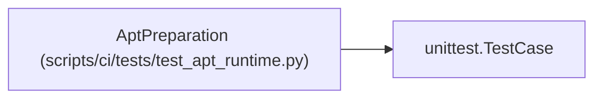

# AptPreparation

**Location:** `scripts/ci/tests/test_apt_runtime.py:11`
**Kind:** Class
**Bases:** `unittest.TestCase`
**Module:** [test_apt_runtime](../modules/test_apt_runtime.md)

## Description

_Auto-generated from `AptPreparation` in `scripts/ci/tests/test_apt_runtime.py`._

## Attributes

*No annotated attributes found.*

## Methods

| Method | Signature | Decorators | Description |
|--------|-----------|------------|-------------|
| `test_legacy_and_deb822_sources_keep_signing_and_unrelated_repositories` | `()` | — | — |
| `test_arm_sources_use_ports_and_only_exact_azure_host_is_replaced` | `()` | — | — |
| `test_unsupported_architecture_does_not_mutate_configuration` | `()` | — | — |

## Relationships

<!-- Auto-generated relationship summary. Do not edit by hand. -->

### Summary

| Module | Methods | Attributes |
|---|---:|---|
| [test_apt_runtime](../modules/test_apt_runtime.md) | 3 | — |

### Structure

| Kind | Entity | Module |
|---|---|---|
| Base | `unittest.TestCase` | — |
