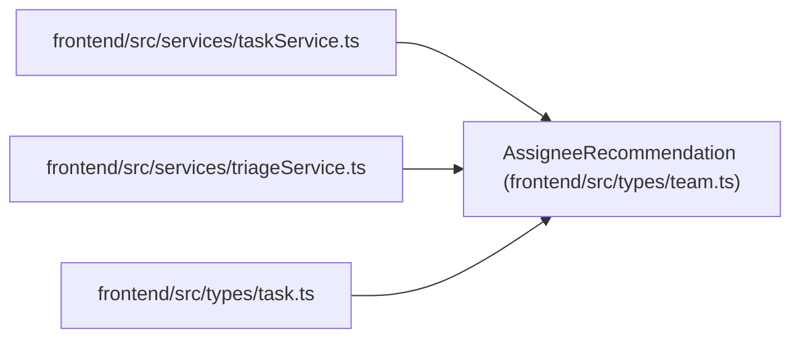

# AssigneeRecommendation

**Location:** `frontend/src/types/team.ts:164`
**Kind:** Class
**Bases:** —
**Module:** [types_team](../modules/types_team.md)

## Description

_Auto-generated from `AssigneeRecommendation` in `frontend/src/types/team.ts`._

## Attributes

| Name | Type | Default | Description |
|------|------|---------|-------------|
| `team_member_id` | `number` | *required* | — |
| `name` | `string` | *required* | — |
| `position` | `string` | *required* | — |
| `profile_id` | `number \| null` | *required* | — |
| `score` | `number` | *required* | — |
| `confidence` | `number` | *required* | — |
| `matched_skills` | `string[]` | *required* | — |
| `weakness_matches` | `string[]` | *required* | — |
| `workload_warnings` | `string[]` | *required* | — |
| `rationale` | `string` | *required* | — |

## Methods

*No public methods. Inherits from base classes.*

## Relationships

<!-- Auto-generated relationship summary. Do not edit by hand. -->

### Summary

| Module | Methods | Attributes |
|---|---:|---|
| [types_team](../modules/types_team.md) | 0 | `confidence`, `matched_skills`, `name`, `position`, `profile_id`, `rationale`, `score`, `team_member_id`, `weakness_matches`, `workload_warnings` |

### References

| Reference | Kind | Source | Call sites |
|---|---|---|---:|
| `taskService` | import | [taskService](../modules/taskService.md) | — |
| `triageService` | import | [triageService](../modules/triageService.md) | — |
| `task` | import | [types_task](../modules/types_task.md) | — |
