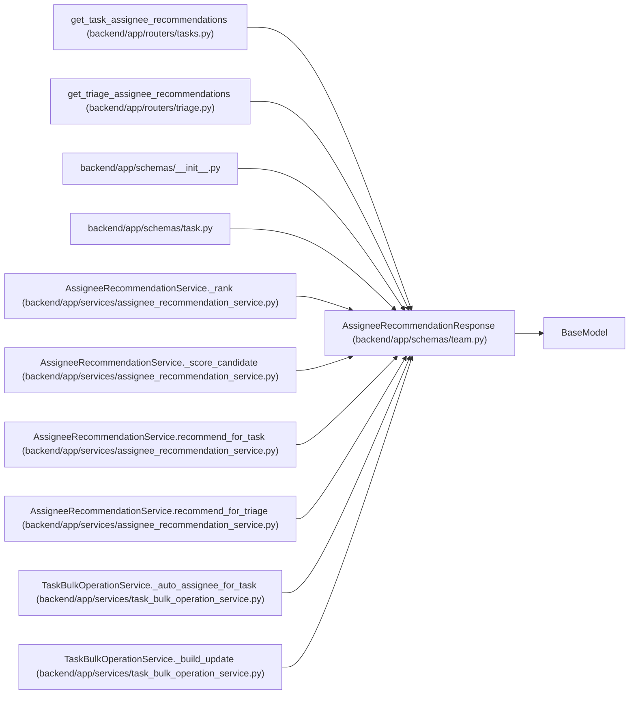

# AssigneeRecommendationResponse

**Location:** `backend/app/schemas/team.py:352`
**Kind:** Pydantic model
**Bases:** `BaseModel`
**Module:** [schemas_team](../modules/schemas_team.md)

## Description

Explainable candidate score for assigning a task or triage item.

## Attributes

| Name | Type | Wire name | Required | Nullable | Default | Constraints | Examples | Description |
|------|------|-----------|----------|----------|---------|-------------|-------------|----------|
| `team_member_id` | `int` | `team_member_id` | Yes | No | — | — | — | — |
| `name` | `str` | `name` | Yes | No | — | — | — | — |
| `position` | `str` | `position` | Yes | No | — | — | — | — |
| `profile_id` | `Optional[int]` | `profile_id` | No | Yes | `None` | — | — | — |
| `score` | `float` | `score` | Yes | No | — | — | — | — |
| `confidence` | `float` | `confidence` | Yes | No | — | — | — | — |
| `matched_skills` | `list[str]` | `matched_skills` | No | No | factory: `list` | — | — | — |
| `weakness_matches` | `list[str]` | `weakness_matches` | No | No | factory: `list` | — | — | — |
| `workload_warnings` | `list[str]` | `workload_warnings` | No | No | factory: `list` | — | — | — |
| `rationale` | `str` | `rationale` | Yes | No | — | — | — | — |

## Methods

*No public methods. Inherits from base classes.*

## Relationships

<!-- Auto-generated relationship summary. Do not edit by hand. -->

### Summary

| Module | Methods | Attributes |
|---|---:|---|
| [schemas_team](../modules/schemas_team.md) | 0 | `confidence`, `matched_skills`, `name`, `position`, `profile_id`, `rationale`, `score`, `team_member_id`, `weakness_matches`, `workload_warnings` |

### Structure

| Kind | Entity | Module |
|---|---|---|
| Base | `BaseModel` | — |

### References

| Reference | Kind | Source | Call sites |
|---|---|---|---:|
| `get_task_assignee_recommendations` | type_reference | [tasks](../modules/tasks.md) | — |
| `get_triage_assignee_recommendations` | type_reference | [routers_triage](../modules/routers_triage.md) | — |
| `__init__` | import | [schemas___init__](../modules/schemas___init__.md) | — |
| `task` | import | [schemas_task](../modules/schemas_task.md) | — |
| `AssigneeRecommendationService._rank` | type_reference | [assignee_recommendation_service](../modules/assignee_recommendation_service.md) | — |
| `AssigneeRecommendationService._score_candidate` | call | [assignee_recommendation_service](../modules/assignee_recommendation_service.md) | 1 |
| `AssigneeRecommendationService._score_candidate` | type_reference | [assignee_recommendation_service](../modules/assignee_recommendation_service.md) | — |
| `AssigneeRecommendationService.recommend_for_task` | type_reference | [assignee_recommendation_service](../modules/assignee_recommendation_service.md) | — |
| `AssigneeRecommendationService.recommend_for_triage` | type_reference | [assignee_recommendation_service](../modules/assignee_recommendation_service.md) | — |
| `TaskBulkOperationService._auto_assignee_for_task` | type_reference | [task_bulk_operation_service](../modules/task_bulk_operation_service.md) | — |
| `TaskBulkOperationService._build_update` | type_reference | [task_bulk_operation_service](../modules/task_bulk_operation_service.md) | — |
