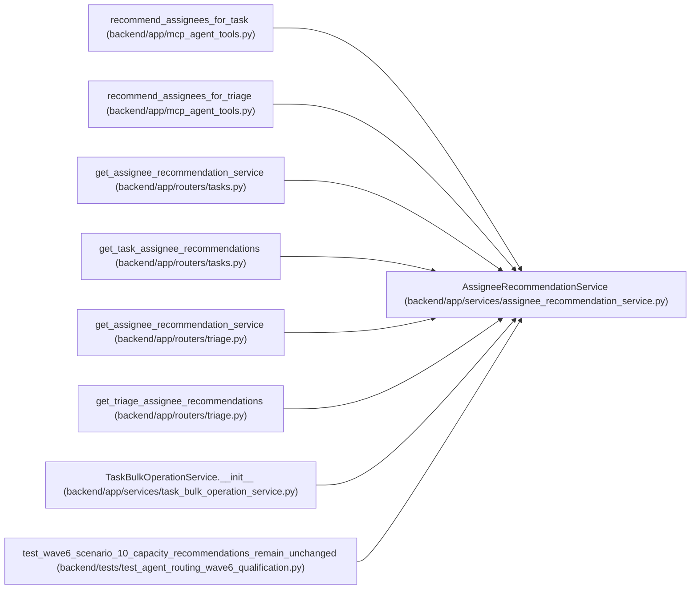

# AssigneeRecommendationService

**Location:** `backend/app/services/assignee_recommendation_service.py:38`
**Kind:** Class
**Bases:** —
**Module:** [assignee_recommendation_service](../modules/assignee_recommendation_service.md)

## Description

Rank iteration team members for task and triage assignment.

## Attributes

*No annotated attributes found.*

## Methods

| Method | Signature | Decorators | Description |
|--------|-----------|------------|-------------|
| `__init__` | `(db: AsyncSession)` | — | — |
| `recommend_for_triage` | *(async)* `(triage_item_id: int, iteration_id: Optional[int] = None) -> Optional[list[AssigneeRecommendationResponse]]` | — | Return ranked assignee recommendations for a triage item. |
| `recommend_for_task` | *(async)* `(task_id: int) -> Optional[list[AssigneeRecommendationResponse]]` | — | Return ranked assignee recommendations for a task. |
| `_latest_classification` | *(async)* `(triage_item_id: int) -> Optional[TriageClassificationSuggestion]` | — | Load the latest stored triage classification suggestion. |
| `_rank` | *(async)* `(iteration_id: int, context: RecommendationContext) -> list[AssigneeRecommendationResponse]` | — | Rank all team members in an iteration against normalized context. |
| `_score_candidate` | *(async)* `(member: TeamMember, context: RecommendationContext) -> AssigneeRecommendationResponse` | — | Score one candidate and build a readable rationale. |
| `_skill_matches` | `(skill: TeamMemberProfileSkill, context_text: str) -> bool` | — | Return true when a skill record overlaps the work context. |
| `_context_text` | `(context: RecommendationContext) -> str` | — | Build lowercase searchable text for a work item. |
| `_context_tokens` | `(text: str) -> set[str]` | — | Return useful tokens from context text. |
| `_normalize` | `(value: str \| None) -> str` | — | Normalize a name or hint for equality checks. |
| `_parse_task_tags` | `(value: Optional[str]) -> list[str]` | — | Parse task tag JSON safely. |
| `_dedupe` | `(values: Sequence[str]) -> list[str]` | — | Preserve first occurrence order while removing duplicates. |

## Relationships

<!-- Auto-generated relationship summary. Do not edit by hand. -->

### Summary

| Module | Methods | Attributes |
|---|---:|---|
| [assignee_recommendation_service](../modules/assignee_recommendation_service.md) | 12 | — |

### References

| Reference | Kind | Source | Call sites |
|---|---|---|---:|
| `recommend_assignees_for_task` | call | [mcp_agent_tools](../modules/mcp_agent_tools.md) | 1 |
| `recommend_assignees_for_triage` | call | [mcp_agent_tools](../modules/mcp_agent_tools.md) | 1 |
| `get_assignee_recommendation_service` | call | [tasks](../modules/tasks.md) | 1 |
| `get_assignee_recommendation_service` | type_reference | [tasks](../modules/tasks.md) | — |
| `get_task_assignee_recommendations` | type_reference | [tasks](../modules/tasks.md) | — |
| `get_assignee_recommendation_service` | call | [routers_triage](../modules/routers_triage.md) | 1 |
| `get_assignee_recommendation_service` | type_reference | [routers_triage](../modules/routers_triage.md) | — |
| `get_triage_assignee_recommendations` | type_reference | [routers_triage](../modules/routers_triage.md) | — |
| `TaskBulkOperationService.__init__` | call | [task_bulk_operation_service](../modules/task_bulk_operation_service.md) | 1 |
| `test_wave6_scenario_10_capacity_recommendations_remain_unchanged` | call | [test_agent_routing_wave6_qualification](../modules/test_agent_routing_wave6_qualification.md) | 1 |
