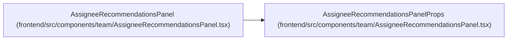

# AssigneeRecommendationsPanelProps

**Location:** `frontend/src/components/team/AssigneeRecommendationsPanel.tsx:9`
**Kind:** Class
**Bases:** —
**Module:** [AssigneeRecommendationsPanel](../modules/AssigneeRecommendationsPanel.md)

## Description

_Auto-generated from `AssigneeRecommendationsPanelProps` in `frontend/src/components/team/AssigneeRecommendationsPanel.tsx`._

## Attributes

| Name | Type | Default | Description |
|------|------|---------|-------------|
| `targetType` | `'task' \| 'triage'` | *required* | — |
| `taskId` | `number` | *required* | — |
| `triageItemId` | `number` | *required* | — |
| `iterationId` | `number \| null` | *required* | — |
| `selectedAssigneeId` | `number \| null` | *required* | — |
| `onSelectAssignee` | `(teamMemberId: number) => void` | *required* | — |

## Methods

*No public methods. Inherits from base classes.*

## Relationships

<!-- Auto-generated relationship summary. Do not edit by hand. -->

### Summary

| Module | Methods | Attributes |
|---|---:|---|
| [AssigneeRecommendationsPanel](../modules/AssigneeRecommendationsPanel.md) | 0 | `iterationId`, `onSelectAssignee`, `selectedAssigneeId`, `targetType`, `taskId`, `triageItemId` |

### References

| Reference | Kind | Source | Call sites |
|---|---|---|---:|
| `AssigneeRecommendationsPanel` | type_reference | [AssigneeRecommendationsPanel](../modules/AssigneeRecommendationsPanel.md) | — |
