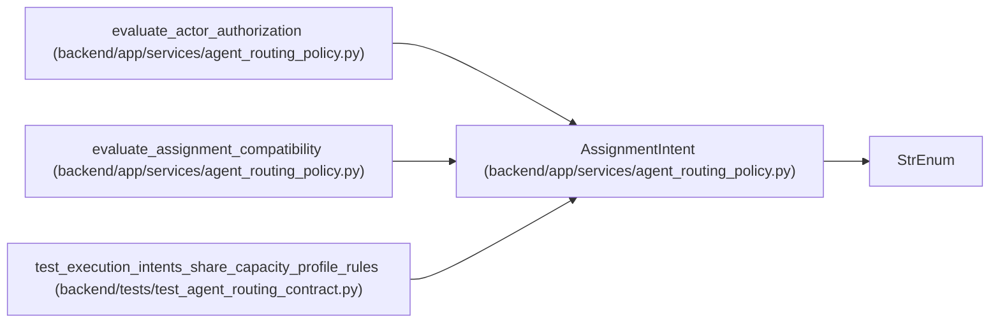

# AssignmentIntent

**Location:** `backend/app/services/agent_routing_policy.py:177`
**Kind:** Enum
**Bases:** `StrEnum`
**Module:** [agent_routing_policy](../modules/agent_routing_policy.md)

## Description

Normalized assignment intents derived from purpose and queue class.

## Attributes

| Name | Declared value | Description |
|------|-------|-------------|
| `EXECUTION` | `'execution'` | — |
| `VERIFICATION` | `'verification'` | — |
| `REWORK` | `'rework'` | — |
| `RECOVERY` | `'recovery'` | — |

## Methods

*No public methods. Inherits from base classes.*

## Relationships

<!-- Auto-generated relationship summary. Do not edit by hand. -->

### Summary

| Module | Methods | Attributes |
|---|---:|---|
| [agent_routing_policy](../modules/agent_routing_policy.md) | 0 | `EXECUTION`, `RECOVERY`, `REWORK`, `VERIFICATION` |

### Structure

| Kind | Entity | Module |
|---|---|---|
| Base | `StrEnum` | — |

### References

| Reference | Kind | Source | Call sites |
|---|---|---|---:|
| `evaluate_actor_authorization` | call | [agent_routing_policy](../modules/agent_routing_policy.md) | 1 |
| `evaluate_assignment_compatibility` | call | [agent_routing_policy](../modules/agent_routing_policy.md) | 1 |
| `test_execution_intents_share_capacity_profile_rules` | type_reference | [test_agent_routing_contract](../modules/test_agent_routing_contract.md) | — |
