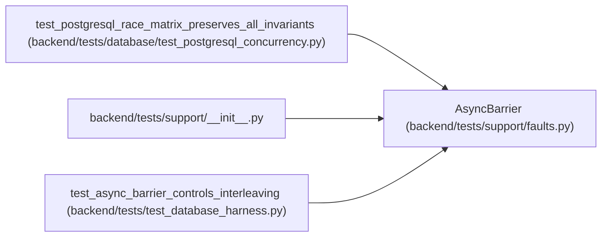

# AsyncBarrier

**Location:** `backend/tests/support/faults.py:45`
**Kind:** Class
**Bases:** —
**Module:** [faults](../modules/faults.md)

## Description

Reusable asyncio barrier for controlled concurrency interleavings.

## Attributes

*No annotated attributes found.*

## Methods

| Method | Signature | Decorators | Description |
|--------|-----------|------------|-------------|
| `__init__` | `(participants: int) -> None` | — | — |
| `wait` | *(async)* `() -> None` | — | — |

## Relationships

<!-- Auto-generated relationship summary. Do not edit by hand. -->

### Summary

| Module | Methods | Attributes |
|---|---:|---|
| [faults](../modules/faults.md) | 2 | — |

### References

| Reference | Kind | Source | Call sites |
|---|---|---|---:|
| `test_postgresql_race_matrix_preserves_all_invariants` | call | [test_postgresql_concurrency](../modules/test_postgresql_concurrency.md) | 8 |
| `__init__` | import | [support___init__](../modules/support___init__.md) | — |
| `test_async_barrier_controls_interleaving` | call | [test_database_harness](../modules/test_database_harness.md) | 1 |
