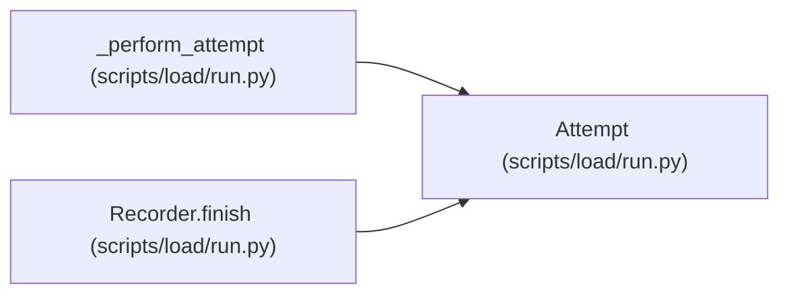

# Attempt

**Location:** `scripts/load/run.py:69`
**Kind:** Class
**Bases:** —
**Module:** [run](../modules/run.md)

**Decorators:** `@dataclass`

## Description

_Auto-generated from `Attempt` in `scripts/load/run.py`._

## Attributes

| Name | Type | Default | Description |
|------|------|---------|-------------|
| `operation_id` | `str` | *required* | — |
| `classification` | `str` | *required* | — |
| `status` | `int` | *required* | — |
| `latency_ms` | `float` | *required* | — |
| `request_bytes` | `int` | *required* | — |
| `response_bytes` | `int` | *required* | — |
| `response_cardinality` | `int` | *required* | — |
| `entity_category` | `str` | *required* | — |
| `payload_profile` | `str` | *required* | — |
| `response_profile` | `str` | *required* | — |
| `client_kind` | `str` | *required* | — |

## Methods

*No public methods. Inherits from base classes.*

## Relationships

<!-- Auto-generated relationship summary. Do not edit by hand. -->

### Summary

| Module | Methods | Attributes |
|---|---:|---|
| [run](../modules/run.md) | 0 | `classification`, `client_kind`, `entity_category`, `latency_ms`, `operation_id`, `payload_profile`, `request_bytes`, `response_bytes`, `response_cardinality`, `response_profile`, `status` |

### References

| Reference | Kind | Source | Call sites |
|---|---|---|---:|
| `_perform_attempt` | call | [run](../modules/run.md) | 3 |
| `Recorder.finish` | type_reference | [run](../modules/run.md) | — |
