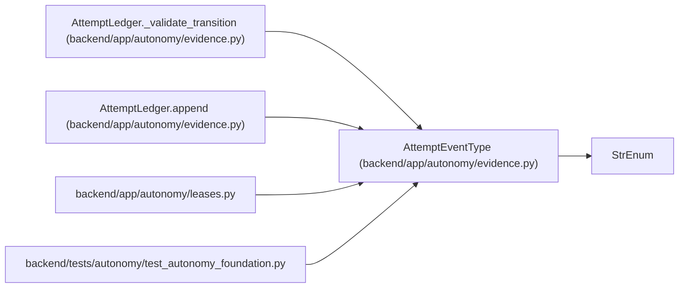

# AttemptEventType

**Location:** `backend/app/autonomy/evidence.py:236`
**Kind:** Enum
**Bases:** `StrEnum`
**Module:** [evidence](../modules/evidence.md)

## Description

_Auto-generated from `AttemptEventType` in `backend/app/autonomy/evidence.py`._

## Attributes

| Name | Declared value | Description |
|------|-------|-------------|
| `ALLOCATED` | `'allocated'` | — |
| `STARTED` | `'started'` | — |
| `CHECKPOINT` | `'checkpoint'` | — |
| `FAILED` | `'failed'` | — |
| `STOPPED` | `'stopped'` | — |
| `RESET` | `'reset'` | — |
| `EVALUATED` | `'evaluated'` | — |
| `FINAL` | `'final'` | — |

## Methods

*No public methods. Inherits from base classes.*

## Relationships

<!-- Auto-generated relationship summary. Do not edit by hand. -->

### Summary

| Module | Methods | Attributes |
|---|---:|---|
| [evidence](../modules/evidence.md) | 0 | `ALLOCATED`, `CHECKPOINT`, `EVALUATED`, `FAILED`, `FINAL`, `RESET`, `STARTED`, `STOPPED` |

### Structure

| Kind | Entity | Module |
|---|---|---|
| Base | `StrEnum` | — |

### References

| Reference | Kind | Source | Call sites |
|---|---|---|---:|
| `AttemptLedger._validate_transition` | type_reference | [evidence](../modules/evidence.md) | — |
| `AttemptLedger.append` | type_reference | [evidence](../modules/evidence.md) | — |
| `leases` | import | [leases](../modules/leases.md) | — |
| `test_autonomy_foundation` | import | [test_autonomy_foundation](../modules/test_autonomy_foundation.md) | — |
