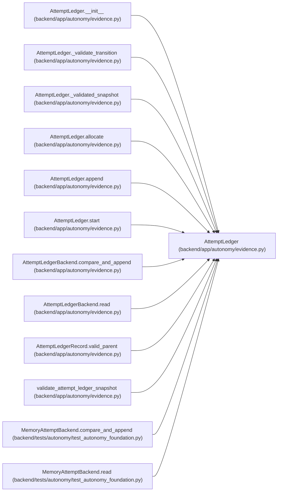

# AttemptLedger

**Location:** `backend/app/autonomy/evidence.py:325`
**Kind:** Class
**Bases:** —
**Module:** [evidence](../modules/evidence.md)

## Description

Allocate attempt numbers and append every lifecycle fact before action.

## Attributes

*No annotated attributes found.*

## Methods

| Method | Signature | Decorators | Description |
|--------|-----------|------------|-------------|
| `__init__` | `(*, backend: AttemptLedgerBackend, clock: Callable[[], datetime] = lambda: datetime.now(UTC), maximum_cas_attempts: int = 8) -> None` | — | — |
| `allocate` | `(*, run_id: str, task_id: str, stage_id: str, action_id: str, release_fingerprint: str, charter_digest: str, contract_manifest_digest: str) -> AttemptLedgerRecord` | — | — |
| `append` | `(*, attempt_id: int, event_type: AttemptEventType, evidence_digest: str \| None = None, normalized_reason_code: str \| None = None) -> AttemptLedgerRecord` | — | — |
| `start` | `(*, attempt_id: int) -> AttemptLedgerRecord` | — | — |
| `_validated_snapshot` | `() -> AttemptLedgerSnapshot` | — | — |
| `_validate_transition` | `(records: list[AttemptLedgerRecord], event_type: AttemptEventType) -> None` | `@staticmethod` | — |

## Relationships

<!-- Auto-generated relationship summary. Do not edit by hand. -->

### Summary

| Module | Methods | Attributes |
|---|---:|---|
| [evidence](../modules/evidence.md) | 6 | — |

### References

| Reference | Kind | Source | Call sites |
|---|---|---|---:|
| `AttemptLedger.__init__` | type_reference | [evidence](../modules/evidence.md) | — |
| `AttemptLedger._validate_transition` | type_reference | [evidence](../modules/evidence.md) | — |
| `AttemptLedger._validated_snapshot` | type_reference | [evidence](../modules/evidence.md) | — |
| `AttemptLedger.allocate` | type_reference | [evidence](../modules/evidence.md) | — |
| `AttemptLedger.append` | type_reference | [evidence](../modules/evidence.md) | — |
| `AttemptLedger.start` | type_reference | [evidence](../modules/evidence.md) | — |
| `AttemptLedgerBackend.compare_and_append` | type_reference | [evidence](../modules/evidence.md) | — |
| `AttemptLedgerBackend.read` | type_reference | [evidence](../modules/evidence.md) | — |
| `AttemptLedgerRecord.valid_parent` | type_reference | [evidence](../modules/evidence.md) | — |
| `validate_attempt_ledger_snapshot` | type_reference | [evidence](../modules/evidence.md) | — |
| `MemoryAttemptBackend.compare_and_append` | type_reference | [test_autonomy_foundation](../modules/test_autonomy_foundation.md) | — |
| `MemoryAttemptBackend.read` | type_reference | [test_autonomy_foundation](../modules/test_autonomy_foundation.md) | — |

> References: showing 12 of 14 logical references; 2 omitted by the 12-row generated summary limit.
