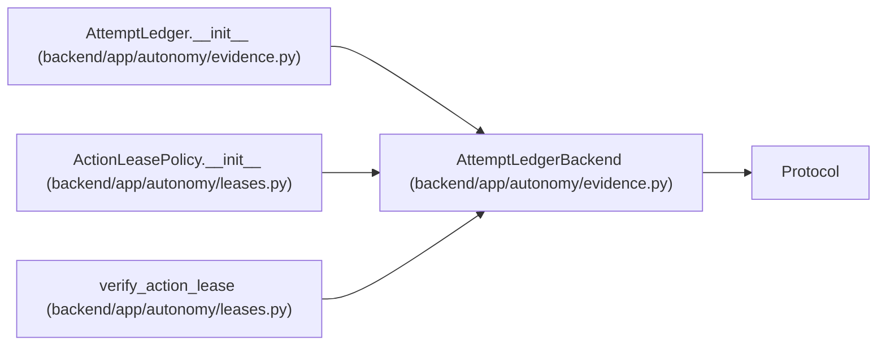

# AttemptLedgerBackend

**Location:** `backend/app/autonomy/evidence.py:307`
**Kind:** Class
**Bases:** `Protocol`
**Module:** [evidence](../modules/evidence.md)

**Decorators:** `@runtime_checkable`

## Description

External CAS ledger physically independent of WorkChord PostgreSQL.

## Attributes

*No annotated attributes found.*

## Methods

| Method | Signature | Decorators | Description |
|--------|-----------|------------|-------------|
| `read` | `() -> AttemptLedgerSnapshot` | — | — |
| `compare_and_append` | `(*, expected_revision: int, expected_head_digest: str, record: AttemptLedgerRecord) -> bool` | — | — |

## Relationships

<!-- Auto-generated relationship summary. Do not edit by hand. -->

### Summary

| Module | Methods | Attributes |
|---|---:|---|
| [evidence](../modules/evidence.md) | 2 | — |

### Structure

| Kind | Entity | Module |
|---|---|---|
| Base | `Protocol` | — |

### References

| Reference | Kind | Source | Call sites |
|---|---|---|---:|
| `AttemptLedger.__init__` | type_reference | [evidence](../modules/evidence.md) | — |
| `ActionLeasePolicy.__init__` | type_reference | [leases](../modules/leases.md) | — |
| `verify_action_lease` | type_reference | [leases](../modules/leases.md) | — |
