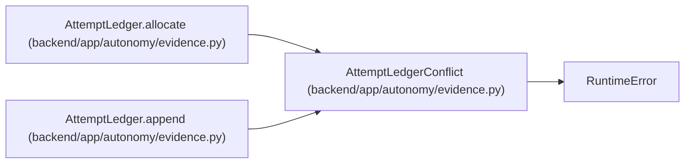

# AttemptLedgerConflict

**Location:** `backend/app/autonomy/evidence.py:321`
**Kind:** Class
**Bases:** `RuntimeError`
**Module:** [evidence](../modules/evidence.md)

## Description

_Auto-generated from `AttemptLedgerConflict` in `backend/app/autonomy/evidence.py`._

## Attributes

*No annotated attributes found.*

## Methods

*No public methods. Inherits from base classes.*

## Relationships

<!-- Auto-generated relationship summary. Do not edit by hand. -->

### Summary

| Module | Methods | Attributes |
|---|---:|---|
| [evidence](../modules/evidence.md) | 0 | — |

### Structure

| Kind | Entity | Module |
|---|---|---|
| Base | `RuntimeError` | — |

### References

| Reference | Kind | Source | Call sites |
|---|---|---|---:|
| `AttemptLedger.allocate` | call | [evidence](../modules/evidence.md) | 1 |
| `AttemptLedger.append` | call | [evidence](../modules/evidence.md) | 1 |
