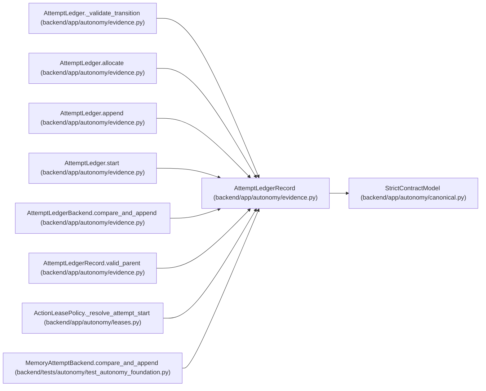

# AttemptLedgerRecord

**Location:** `backend/app/autonomy/evidence.py:247`
**Kind:** Pydantic model
**Bases:** `StrictContractModel`
**Module:** [evidence](../modules/evidence.md)

## Description

_Auto-generated from `AttemptLedgerRecord` in `backend/app/autonomy/evidence.py`._

## Validators

| Method | Scope | Fields | Mode | Options |
|--------|-------|--------|------|---------|
| `aware_recorded_at` | field | recorded_at | after | — |
| `valid_parent` | model | — | after | — |

## Attributes

| Name | Type | Wire name | Required | Nullable | Default | Constraints | Examples | Description |
|------|------|-----------|----------|----------|---------|-------------|-------------|----------|
| `schema_version` | `Literal['workchord-attempt-ledger-record-v1']` | `schema_version` | No | No | `'workchord-attempt-ledger-record-v1'` | — | — | — |
| `attempt_id` | `int` | `attempt_id` | Yes | No | — | ge=1 | — | — |
| `sequence` | `int` | `sequence` | Yes | No | — | ge=1 | — | — |
| `event_type` | `AttemptEventType` | `event_type` | Yes | No | — | — | — | — |
| `run_id` | `str` | `run_id` | Yes | No | — | pattern=unknown (IDENTIFIER_PATTERN) | — | — |
| `task_id` | `str` | `task_id` | Yes | No | — | pattern=unknown (IDENTIFIER_PATTERN) | — | — |
| `stage_id` | `str` | `stage_id` | Yes | No | — | pattern=unknown (IDENTIFIER_PATTERN) | — | — |
| `action_id` | `str` | `action_id` | Yes | No | — | pattern=unknown (IDENTIFIER_PATTERN) | — | — |
| `release_fingerprint` | `str` | `release_fingerprint` | Yes | No | — | pattern=unknown (SHA256_PATTERN) | — | — |
| `charter_digest` | `str` | `charter_digest` | Yes | No | — | pattern=unknown (SHA256_PATTERN) | — | — |
| `contract_manifest_digest` | `str` | `contract_manifest_digest` | Yes | No | — | pattern=unknown (SHA256_PATTERN) | — | — |
| `recorded_at` | `datetime` | `recorded_at` | Yes | No | — | — | — | — |
| `previous_hash` | `str` | `previous_hash` | Yes | No | — | pattern=unknown (SHA256_PATTERN) | — | — |
| `evidence_digest` | `str \| None` | `evidence_digest` | No | Yes | `None` | pattern=unknown (SHA256_PATTERN) | — | — |
| `normalized_reason_code` | `str \| None` | `normalized_reason_code` | No | Yes | `None` | pattern=unknown (IDENTIFIER_PATTERN) | — | — |

## Methods

| Method | Signature | Decorators | Description |
|--------|-----------|------------|-------------|
| `aware_recorded_at` | `(value: datetime) -> datetime` | `@field_validator('recorded_at')`, `@classmethod` | — |
| `valid_parent` | `() -> 'AttemptLedgerRecord'` | `@model_validator(mode='after')` | — |
| `digest` | `() -> str` | — | — |

## Relationships

<!-- Auto-generated relationship summary. Do not edit by hand. -->

### Summary

| Module | Methods | Attributes |
|---|---:|---|
| [evidence](../modules/evidence.md) | 3 | `action_id`, `attempt_id`, `charter_digest`, `contract_manifest_digest`, `event_type`, `evidence_digest`, `normalized_reason_code`, `previous_hash`, `recorded_at`, `release_fingerprint`, `run_id`, `schema_version` |

### Structure

| Kind | Entity | Module |
|---|---|---|
| Base | `StrictContractModel` | [autonomy_canonical](../modules/autonomy_canonical.md) |

### References

| Reference | Kind | Source | Call sites |
|---|---|---|---:|
| `AttemptLedger._validate_transition` | type_reference | [evidence](../modules/evidence.md) | — |
| `AttemptLedger.allocate` | call | [evidence](../modules/evidence.md) | 1 |
| `AttemptLedger.allocate` | type_reference | [evidence](../modules/evidence.md) | — |
| `AttemptLedger.append` | call | [evidence](../modules/evidence.md) | 1 |
| `AttemptLedger.append` | type_reference | [evidence](../modules/evidence.md) | — |
| `AttemptLedger.start` | type_reference | [evidence](../modules/evidence.md) | — |
| `AttemptLedgerBackend.compare_and_append` | type_reference | [evidence](../modules/evidence.md) | — |
| `AttemptLedgerRecord.valid_parent` | type_reference | [evidence](../modules/evidence.md) | — |
| `ActionLeasePolicy._resolve_attempt_start` | type_reference | [leases](../modules/leases.md) | — |
| `MemoryAttemptBackend.compare_and_append` | type_reference | [test_autonomy_foundation](../modules/test_autonomy_foundation.md) | — |
