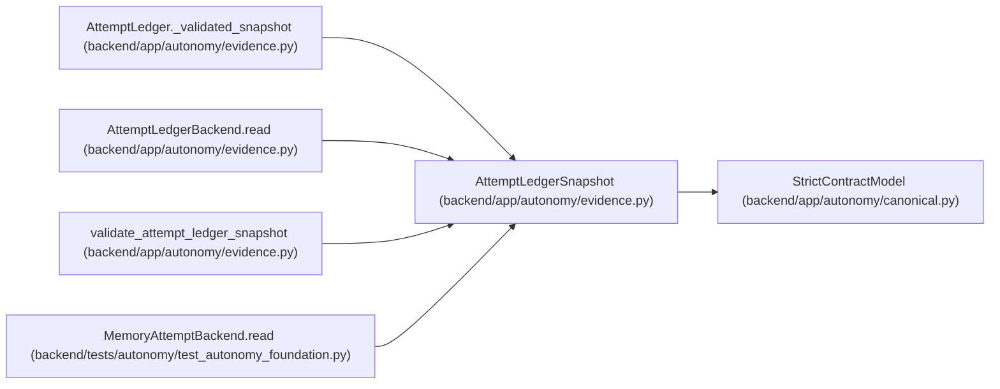

# AttemptLedgerSnapshot

**Location:** `backend/app/autonomy/evidence.py:300`
**Kind:** Pydantic model
**Bases:** `StrictContractModel`
**Module:** [evidence](../modules/evidence.md)

## Description

_Auto-generated from `AttemptLedgerSnapshot` in `backend/app/autonomy/evidence.py`._

## Attributes

| Name | Type | Wire name | Required | Nullable | Default | Constraints | Examples | Description |
|------|------|-----------|----------|----------|---------|-------------|-------------|----------|
| `revision` | `int` | `revision` | Yes | No | — | ge=0 | — | — |
| `head_digest` | `str` | `head_digest` | Yes | No | — | pattern=unknown (SHA256_PATTERN) | — | — |
| `records` | `tuple[AttemptLedgerRecord, ...]` | `records` | No | No | `()` | max_length=1000000 | — | — |

## Methods

*No public methods. Inherits from base classes.*

## Relationships

<!-- Auto-generated relationship summary. Do not edit by hand. -->

### Summary

| Module | Methods | Attributes |
|---|---:|---|
| [evidence](../modules/evidence.md) | 0 | `head_digest`, `records`, `revision` |

### Structure

| Kind | Entity | Module |
|---|---|---|
| Base | `StrictContractModel` | [autonomy_canonical](../modules/autonomy_canonical.md) |

### References

| Reference | Kind | Source | Call sites |
|---|---|---|---:|
| `AttemptLedger._validated_snapshot` | type_reference | [evidence](../modules/evidence.md) | — |
| `AttemptLedgerBackend.read` | type_reference | [evidence](../modules/evidence.md) | — |
| `validate_attempt_ledger_snapshot` | type_reference | [evidence](../modules/evidence.md) | — |
| `MemoryAttemptBackend.read` | call | [test_autonomy_foundation](../modules/test_autonomy_foundation.md) | 1 |
| `MemoryAttemptBackend.read` | type_reference | [test_autonomy_foundation](../modules/test_autonomy_foundation.md) | — |
