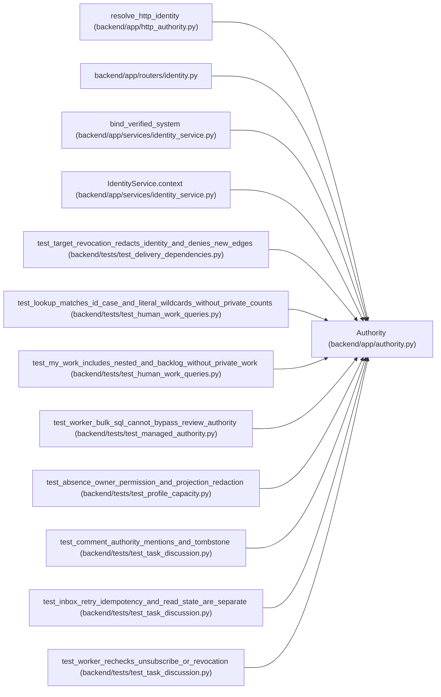

# Authority

**Location:** `backend/app/authority.py:24`
**Kind:** Class
**Bases:** —
**Module:** [authority](../modules/authority.md)

**Decorators:** `@dataclass(frozen=True)`

## Description

_Auto-generated from `Authority` in `backend/app/authority.py`._

Managed authority combines a durable principal, workspace/project roles, and actor scopes. ORM reads constrain related records and writes require the relevant action; review is distinct from execution. Trusted-local collaboration is an explicit deployment mode. Narrow internal identity resolution and verified system integrations are server-owned boundaries, not caller-provided identity claims.

## Attributes

| Name | Type | Default | Description |
|------|------|---------|-------------|
| `principal_id` | `int \| None` | *required* | — |
| `kind` | `str` | *required* | — |
| `workspace_role` | `str \| None` | `None` | — |
| `projects` | `dict[int, str]` | `field(default_factory=dict)` | — |
| `actor_id` | `int \| None` | `None` | — |
| `actor_role` | `str \| None` | `None` | — |
| `session_id` | `int \| None` | `None` | — |
| `profile_id` | `int \| None` | `None` | — |
| `source` | `str` | `'rest'` | — |
| `correlation_id` | `str` | `field(default_factory=lambda: uuid4().hex)` | — |
| `reason` | `str \| None` | `None` | — |
| `review_override` | `bool` | `False` | — |
| `local` | `bool` | `False` | — |
| `scopes` | `frozenset[str]` | `frozenset()` | — |

## Methods

| Method | Signature | Decorators | Description |
|--------|-----------|------------|-------------|
| `operator` | `()` | `@property` | — |
| `allows` | `(project_id, action = 'read')` | — | — |

## Relationships

<!-- Auto-generated relationship summary. Do not edit by hand. -->

### Summary

| Module | Methods | Attributes |
|---|---:|---|
| [authority](../modules/authority.md) | 2 | `actor_id`, `actor_role`, `correlation_id`, `kind`, `local`, `principal_id`, `profile_id`, `projects`, `reason`, `review_override`, `scopes`, `session_id` |

### References

| Reference | Kind | Source | Call sites |
|---|---|---|---:|
| `resolve_http_identity` | call | [http_authority](../modules/http_authority.md) | 3 |
| `identity` | import | [routers_identity](../modules/routers_identity.md) | — |
| `bind_verified_system` | call | [identity_service](../modules/identity_service.md) | 1 |
| `IdentityService.context` | call | [identity_service](../modules/identity_service.md) | 1 |
| `test_target_revocation_redacts_identity_and_denies_new_edges` | call | [test_delivery_dependencies](../modules/test_delivery_dependencies.md) | 1 |
| `test_lookup_matches_id_case_and_literal_wildcards_without_private_counts` | call | [test_human_work_queries](../modules/test_human_work_queries.md) | 1 |
| `test_my_work_includes_nested_and_backlog_without_private_work` | call | [test_human_work_queries](../modules/test_human_work_queries.md) | 1 |
| `test_worker_bulk_sql_cannot_bypass_review_authority` | call | [test_managed_authority](../modules/test_managed_authority.md) | 1 |
| `test_absence_owner_permission_and_projection_redaction` | call | [test_profile_capacity](../modules/test_profile_capacity.md) | 1 |
| `test_comment_authority_mentions_and_tombstone` | call | [test_task_discussion](../modules/test_task_discussion.md) | 2 |
| `test_inbox_retry_idempotency_and_read_state_are_separate` | call | [test_task_discussion](../modules/test_task_discussion.md) | 1 |
| `test_worker_rechecks_unsubscribe_or_revocation` | call | [test_task_discussion](../modules/test_task_discussion.md) | 2 |

> References: showing 12 of 19 logical references; 7 omitted by the 12-row generated summary limit.
