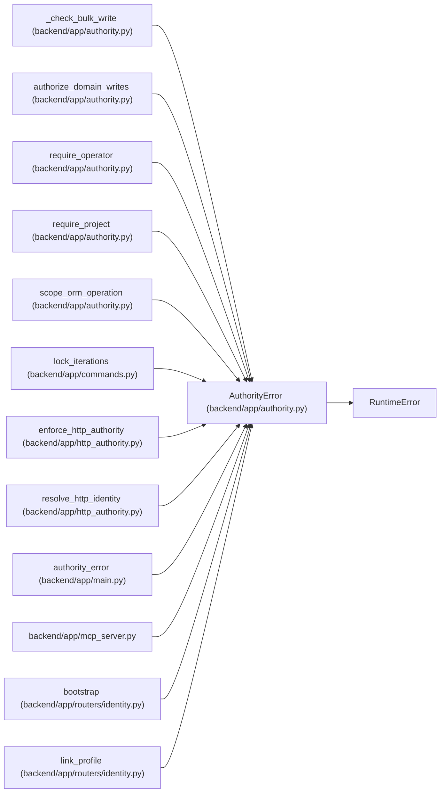

# AuthorityError

**Location:** `backend/app/authority.py:14`
**Kind:** Class
**Bases:** `RuntimeError`
**Module:** [authority](../modules/authority.md)

## Description

_Auto-generated from `AuthorityError` in `backend/app/authority.py`._

## Attributes

*No annotated attributes found.*

## Methods

| Method | Signature | Decorators | Description |
|--------|-----------|------------|-------------|
| `__init__` | `(code = 'permission_denied', message = 'You do not have permission for this action.', status = 403)` | — | — |
| `detail` | `()` | — | — |

## Relationships

<!-- Auto-generated relationship summary. Do not edit by hand. -->

### Summary

| Module | Methods | Attributes |
|---|---:|---|
| [authority](../modules/authority.md) | 2 | — |

### Structure

| Kind | Entity | Module |
|---|---|---|
| Base | `RuntimeError` | — |

### References

| Reference | Kind | Source | Call sites |
|---|---|---|---:|
| `_check_bulk_write` | call | [authority](../modules/authority.md) | 4 |
| `authorize_domain_writes` | call | [authority](../modules/authority.md) | 10 |
| `require_operator` | call | [authority](../modules/authority.md) | 1 |
| `require_project` | call | [authority](../modules/authority.md) | 2 |
| `scope_orm_operation` | call | [authority](../modules/authority.md) | 2 |
| `lock_iterations` | call | [commands](../modules/commands.md) | 1 |
| `enforce_http_authority` | call | [http_authority](../modules/http_authority.md) | 11 |
| `resolve_http_identity` | call | [http_authority](../modules/http_authority.md) | 11 |
| `authority_error` | type_reference | [app_main](../modules/app_main.md) | — |
| `mcp_server` | import | [mcp_server](../modules/mcp_server.md) | — |
| `bootstrap` | call | [routers_identity](../modules/routers_identity.md) | 3 |
| `link_profile` | call | [routers_identity](../modules/routers_identity.md) | 2 |

> References: showing 12 of 60 logical references; 48 omitted by the 12-row generated summary limit.
