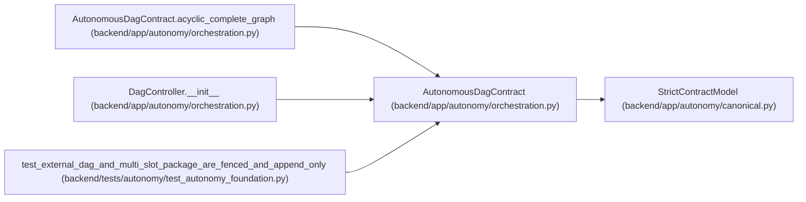

# AutonomousDagContract

**Location:** `backend/app/autonomy/orchestration.py:67`
**Kind:** Pydantic model
**Bases:** `StrictContractModel`
**Module:** [orchestration](../modules/orchestration.md)

## Description

_Auto-generated from `AutonomousDagContract` in `backend/app/autonomy/orchestration.py`._

## Validators

| Method | Scope | Fields | Mode | Options |
|--------|-------|--------|------|---------|
| `acyclic_complete_graph` | model | — | after | — |

## Attributes

| Name | Type | Wire name | Required | Nullable | Default | Constraints | Examples | Description |
|------|------|-----------|----------|----------|---------|-------------|-------------|----------|
| `schema_version` | `Literal['workchord-autonomous-dag-v1']` | `schema_version` | No | No | `'workchord-autonomous-dag-v1'` | — | — | — |
| `run_id` | `str` | `run_id` | Yes | No | — | pattern=unknown (IDENTIFIER_PATTERN) | — | — |
| `release_fingerprint` | `str` | `release_fingerprint` | Yes | No | — | pattern=unknown (SHA256_PATTERN) | — | — |
| `charter_digest` | `str` | `charter_digest` | Yes | No | — | pattern=unknown (SHA256_PATTERN) | — | — |
| `contract_manifest_digest` | `str` | `contract_manifest_digest` | Yes | No | — | pattern=unknown (SHA256_PATTERN) | — | — |
| `nodes` | `tuple[DagNodeSpec, ...]` | `nodes` | Yes | No | — | min_length=1; max_length=10000 | — | — |

## Methods

| Method | Signature | Decorators | Description |
|--------|-----------|------------|-------------|
| `acyclic_complete_graph` | `() -> 'AutonomousDagContract'` | `@model_validator(mode='after')` | — |
| `digest` | `() -> str` | — | — |

## Relationships

<!-- Auto-generated relationship summary. Do not edit by hand. -->

### Summary

| Module | Methods | Attributes |
|---|---:|---|
| [orchestration](../modules/orchestration.md) | 2 | `charter_digest`, `contract_manifest_digest`, `nodes`, `release_fingerprint`, `run_id`, `schema_version` |

### Structure

| Kind | Entity | Module |
|---|---|---|
| Base | `StrictContractModel` | [autonomy_canonical](../modules/autonomy_canonical.md) |

### References

| Reference | Kind | Source | Call sites |
|---|---|---|---:|
| `AutonomousDagContract.acyclic_complete_graph` | type_reference | [orchestration](../modules/orchestration.md) | — |
| `DagController.__init__` | type_reference | [orchestration](../modules/orchestration.md) | — |
| `test_external_dag_and_multi_slot_package_are_fenced_and_append_only` | call | [test_autonomy_foundation](../modules/test_autonomy_foundation.md) | 1 |
