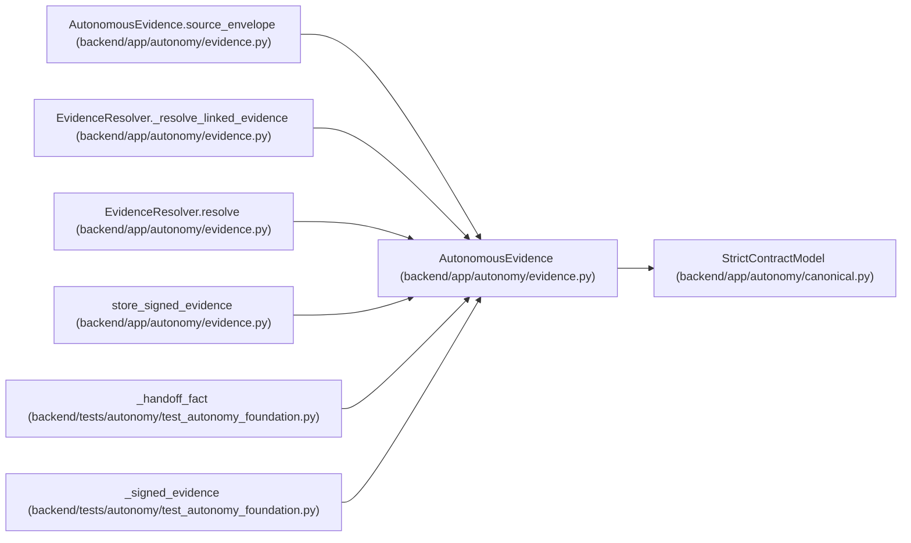

# AutonomousEvidence

**Location:** `backend/app/autonomy/evidence.py:37`
**Kind:** Pydantic model
**Bases:** `StrictContractModel`
**Module:** [evidence](../modules/evidence.md)

## Description

Unsigned canonical source observation submitted to a remote signer.

## Validators

| Method | Scope | Fields | Mode | Options |
|--------|-------|--------|------|---------|
| `aware_times` | field | observed_started_at, observed_ended_at | after | — |
| `unique_parents` | field | parent_hashes | after | — |
| `source_envelope` | model | — | after | — |

## Attributes

| Name | Type | Wire name | Required | Nullable | Default | Constraints | Examples | Description |
|------|------|-----------|----------|----------|---------|-------------|-------------|----------|
| `schema_version` | `Literal['workchord-autonomous-evidence-v1']` | `schema_version` | No | No | `'workchord-autonomous-evidence-v1'` | — | — | — |
| `run_id` | `str` | `run_id` | Yes | No | — | pattern=unknown (IDENTIFIER_PATTERN) | — | — |
| `task_id` | `str` | `task_id` | Yes | No | — | pattern=unknown (IDENTIFIER_PATTERN) | — | — |
| `stage_id` | `str` | `stage_id` | Yes | No | — | pattern=unknown (IDENTIFIER_PATTERN) | — | — |
| `action_id` | `str` | `action_id` | Yes | No | — | pattern=unknown (IDENTIFIER_PATTERN) | — | — |
| `release_fingerprint` | `str` | `release_fingerprint` | Yes | No | — | pattern=unknown (SHA256_PATTERN) | — | — |
| `charter_digest` | `str` | `charter_digest` | Yes | No | — | pattern=unknown (SHA256_PATTERN) | — | — |
| `contract_manifest_digest` | `str` | `contract_manifest_digest` | Yes | No | — | pattern=unknown (SHA256_PATTERN) | — | — |
| `issuer_workload_identity` | `str` | `issuer_workload_identity` | Yes | No | — | min_length=1; max_length=512 | — | — |
| `issuer_role` | `str` | `issuer_role` | Yes | No | — | pattern=unknown (IDENTIFIER_PATTERN) | — | — |
| `source_system` | `str` | `source_system` | Yes | No | — | pattern=unknown (IDENTIFIER_PATTERN) | — | — |
| `source_resource_ref` | `str` | `source_resource_ref` | Yes | No | — | max_length=2048; pattern=unknown (OPAQUE_REF_PATTERN) | — | — |
| `source_resource_generation` | `str` | `source_resource_generation` | Yes | No | — | min_length=1; max_length=255 | — | — |
| `source_receipt_ref` | `str` | `source_receipt_ref` | Yes | No | — | max_length=2048; pattern=unknown (OPAQUE_REF_PATTERN) | — | — |
| `request_digest` | `str` | `request_digest` | Yes | No | — | pattern=unknown (SHA256_PATTERN) | — | — |
| `idempotency_digest` | `str` | `idempotency_digest` | Yes | No | — | pattern=unknown (SHA256_PATTERN) | — | — |
| `observed_started_at` | `datetime` | `observed_started_at` | Yes | No | — | — | — | — |
| `observed_ended_at` | `datetime` | `observed_ended_at` | Yes | No | — | — | — | — |
| `clock_source_ref` | `str` | `clock_source_ref` | Yes | No | — | max_length=2048; pattern=unknown (OPAQUE_REF_PATTERN) | — | — |
| `query_digest` | `str` | `query_digest` | Yes | No | — | pattern=unknown (SHA256_PATTERN) | — | — |
| `exit_code` | `int \| None` | `exit_code` | No | Yes | `None` | ge=0; le=255 | — | — |
| `source_outcome` | `Literal['succeeded', 'failed', 'stopped', 'unavailable']` | `source_outcome` | Yes | No | — | — | — | — |
| `raw_artifact_uri` | `str` | `raw_artifact_uri` | Yes | No | — | max_length=2048; pattern=unknown (OPAQUE_REF_PATTERN) | — | — |
| `raw_artifact_sha256` | `str` | `raw_artifact_sha256` | Yes | No | — | pattern=unknown (SHA256_PATTERN) | — | — |
| `parent_hashes` | `tuple[str, ...]` | `parent_hashes` | No | No | `()` | max_length=256 | — | — |
| `ledger_sequence` | `int` | `ledger_sequence` | Yes | No | — | ge=1 | — | — |
| `previous_hash` | `str` | `previous_hash` | Yes | No | — | pattern=unknown (SHA256_PATTERN) | — | — |
| `redaction_class` | `RedactionClass` | `redaction_class` | Yes | No | — | — | — | — |

## Methods

| Method | Signature | Decorators | Description |
|--------|-----------|------------|-------------|
| `aware_times` | `(value: datetime) -> datetime` | `@field_validator('observed_started_at', 'observed_ended_at')`, `@classmethod` | — |
| `unique_parents` | `(value: tuple[str, ...]) -> tuple[str, ...]` | `@field_validator('parent_hashes')`, `@classmethod` | — |
| `source_envelope` | `() -> 'AutonomousEvidence'` | `@model_validator(mode='after')` | — |
| `digest` | `() -> str` | — | — |

## Relationships

<!-- Auto-generated relationship summary. Do not edit by hand. -->

### Summary

| Module | Methods | Attributes |
|---|---:|---|
| [evidence](../modules/evidence.md) | 4 | `action_id`, `charter_digest`, `clock_source_ref`, `contract_manifest_digest`, `exit_code`, `idempotency_digest`, `issuer_role`, `issuer_workload_identity`, `ledger_sequence`, `observed_ended_at`, `observed_started_at`, `parent_hashes` |

### Structure

| Kind | Entity | Module |
|---|---|---|
| Base | `StrictContractModel` | [autonomy_canonical](../modules/autonomy_canonical.md) |

### References

| Reference | Kind | Source | Call sites |
|---|---|---|---:|
| `AutonomousEvidence.source_envelope` | type_reference | [evidence](../modules/evidence.md) | — |
| `EvidenceResolver._resolve_linked_evidence` | type_reference | [evidence](../modules/evidence.md) | — |
| `EvidenceResolver.resolve` | type_reference | [evidence](../modules/evidence.md) | — |
| `store_signed_evidence` | type_reference | [evidence](../modules/evidence.md) | — |
| `_handoff_fact` | call | [test_autonomy_foundation](../modules/test_autonomy_foundation.md) | 1 |
| `_signed_evidence` | call | [test_autonomy_foundation](../modules/test_autonomy_foundation.md) | 1 |
| `_signed_evidence` | type_reference | [test_autonomy_foundation](../modules/test_autonomy_foundation.md) | — |
