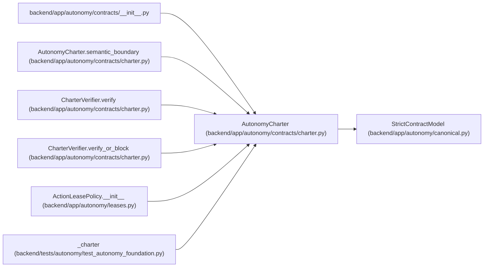

# AutonomyCharter

**Location:** `backend/app/autonomy/contracts/charter.py:154`
**Kind:** Pydantic model
**Bases:** `StrictContractModel`
**Module:** [charter](../modules/charter.md)

## Description

Externally established authority consumed by the autonomous program.

## Validators

| Method | Scope | Fields | Mode | Options |
|--------|-------|--------|------|---------|
| `semantic_boundary` | model | — | after | — |

## Attributes

| Name | Type | Wire name | Required | Nullable | Default | Constraints | Examples | Description |
|------|------|-----------|----------|----------|---------|-------------|-------------|----------|
| `schema_version` | `Literal['workchord-postgresql-autonomy-charter-v1']` | `schema_version` | No | No | `'workchord-postgresql-autonomy-charter-v1'` | — | — | — |
| `charter_id` | `str` | `charter_id` | Yes | No | — | pattern=unknown (IDENTIFIER_PATTERN) | — | — |
| `issuer` | `str` | `issuer` | Yes | No | — | max_length=255; min_length=1 | — | — |
| `subject` | `Literal['workchord-postgresql-autonomous-migration']` | `subject` | Yes | No | — | — | — | — |
| `repository` | `str` | `repository` | Yes | No | — | max_length=1024; pattern=unknown (OPAQUE_REF_PATTERN) | — | — |
| `candidate_branch` | `str` | `candidate_branch` | Yes | No | — | max_length=255; min_length=1 | — | — |
| `push_policy` | `str` | `push_policy` | Yes | No | — | max_length=512; min_length=1 | — | — |
| `project_ref` | `str` | `project_ref` | Yes | No | — | max_length=1024; pattern=unknown (OPAQUE_REF_PATTERN) | — | — |
| `iteration_ref` | `str` | `iteration_ref` | Yes | No | — | max_length=1024; pattern=unknown (OPAQUE_REF_PATTERN) | — | — |
| `task_graph_digest` | `str` | `task_graph_digest` | Yes | No | — | pattern=unknown (SHA256_PATTERN) | — | — |
| `topology_manifest_digest` | `str` | `topology_manifest_digest` | Yes | No | — | pattern=unknown (SHA256_PATTERN) | — | — |
| `bootstrap_action_manifest_digest` | `str` | `bootstrap_action_manifest_digest` | Yes | No | — | pattern=unknown (SHA256_PATTERN) | — | — |
| `contract_manifest_digest` | `str` | `contract_manifest_digest` | Yes | No | — | pattern=unknown (SHA256_PATTERN) | — | — |
| `valid_from` | `datetime` | `valid_from` | Yes | No | — | — | — | — |
| `expires_at` | `datetime` | `expires_at` | Yes | No | — | — | — | — |
| `revocation_source_ref` | `str` | `revocation_source_ref` | Yes | No | — | max_length=1024; pattern=unknown (OPAQUE_REF_PATTERN) | — | — |
| `revocation_max_age_seconds` | `int` | `revocation_max_age_seconds` | Yes | No | — | ge=1; le=3600 | — | — |
| `production_mutation_allowed` | `bool` | `production_mutation_allowed` | Yes | No | — | — | — | — |
| `resources` | `tuple[ExactResourceBinding, ...]` | `resources` | Yes | No | — | max_length=256; min_length=1 | — | — |
| `immutable_inputs` | `tuple[ImmutableInputBinding, ...]` | `immutable_inputs` | Yes | No | — | max_length=256; min_length=1 | — | — |
| `trusted_keys` | `tuple[TrustedKeyBinding, ...]` | `trusted_keys` | Yes | No | — | max_length=64; min_length=1 | — | — |
| `execution_windows` | `tuple[ExecutionWindow, ...]` | `execution_windows` | Yes | No | — | max_length=256; min_length=1 | — | — |
| `budget` | `ExecutionBudget` | `budget` | Yes | No | — | — | — | — |
| `migration_policy` | `MigrationPolicy` | `migration_policy` | Yes | No | — | — | — | — |

## Methods

| Method | Signature | Decorators | Description |
|--------|-----------|------------|-------------|
| `semantic_boundary` | `() -> 'AutonomyCharter'` | `@model_validator(mode='after')` | — |

## Relationships

<!-- Auto-generated relationship summary. Do not edit by hand. -->

### Summary

| Module | Methods | Attributes |
|---|---:|---|
| [charter](../modules/charter.md) | 1 | `bootstrap_action_manifest_digest`, `budget`, `candidate_branch`, `charter_id`, `contract_manifest_digest`, `execution_windows`, `expires_at`, `immutable_inputs`, `issuer`, `iteration_ref`, `migration_policy`, `production_mutation_allowed` |

### Structure

| Kind | Entity | Module |
|---|---|---|
| Base | `StrictContractModel` | [autonomy_canonical](../modules/autonomy_canonical.md) |

### References

| Reference | Kind | Source | Call sites |
|---|---|---|---:|
| `__init__` | import | [contracts___init__](../modules/contracts___init__.md) | — |
| `AutonomyCharter.semantic_boundary` | type_reference | [charter](../modules/charter.md) | — |
| `CharterVerifier.verify` | type_reference | [charter](../modules/charter.md) | — |
| `CharterVerifier.verify_or_block` | type_reference | [charter](../modules/charter.md) | — |
| `ActionLeasePolicy.__init__` | type_reference | [leases](../modules/leases.md) | — |
| `_charter` | call | [test_autonomy_foundation](../modules/test_autonomy_foundation.md) | 1 |
| `_charter` | type_reference | [test_autonomy_foundation](../modules/test_autonomy_foundation.md) | — |
