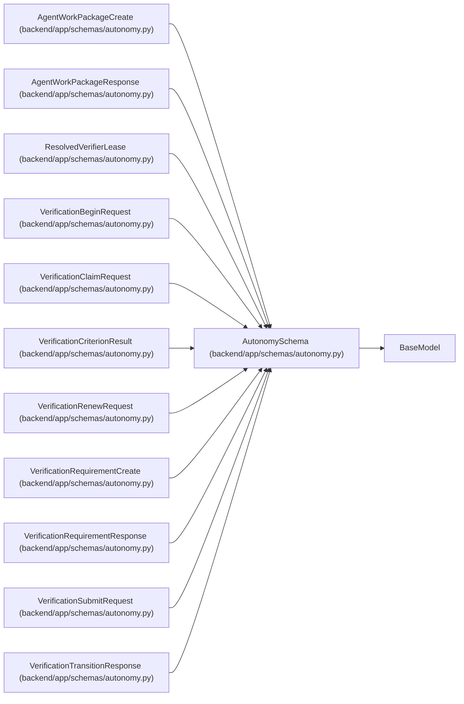

# AutonomySchema

**Location:** `backend/app/schemas/autonomy.py:15`
**Kind:** Pydantic model
**Bases:** `BaseModel`
**Module:** [schemas_autonomy](../modules/schemas_autonomy.md)

## Description

_Auto-generated from `AutonomySchema` in `backend/app/schemas/autonomy.py`._

## Model Configuration

| Setting | Value | Source |
|---------|-------|--------|
| `extra` | `'forbid'` | model_config |
| `str_strip_whitespace` | `True` | model_config |

## Attributes

*No annotated attributes found.*

## Methods

*No public methods. Inherits from base classes.*

## Relationships

<!-- Auto-generated relationship summary. Do not edit by hand. -->

### Summary

| Module | Methods | Attributes |
|---|---:|---|
| [schemas_autonomy](../modules/schemas_autonomy.md) | 0 | — |

### Structure

| Kind | Entity | Module |
|---|---|---|
| Base | `BaseModel` | — |
| Subclass | `AgentWorkPackageCreate` | [schemas_autonomy](../modules/schemas_autonomy.md) |
| Subclass | `AgentWorkPackageResponse` | [schemas_autonomy](../modules/schemas_autonomy.md) |
| Subclass | `ResolvedVerifierLease` | [schemas_autonomy](../modules/schemas_autonomy.md) |
| Subclass | `VerificationBeginRequest` | [schemas_autonomy](../modules/schemas_autonomy.md) |
| Subclass | `VerificationClaimRequest` | [schemas_autonomy](../modules/schemas_autonomy.md) |
| Subclass | `VerificationCriterionResult` | [schemas_autonomy](../modules/schemas_autonomy.md) |
| Subclass | `VerificationRenewRequest` | [schemas_autonomy](../modules/schemas_autonomy.md) |
| Subclass | `VerificationRequirementCreate` | [schemas_autonomy](../modules/schemas_autonomy.md) |
| Subclass | `VerificationRequirementResponse` | [schemas_autonomy](../modules/schemas_autonomy.md) |
| Subclass | `VerificationSubmitRequest` | [schemas_autonomy](../modules/schemas_autonomy.md) |
| Subclass | `VerificationTransitionResponse` | [schemas_autonomy](../modules/schemas_autonomy.md) |
