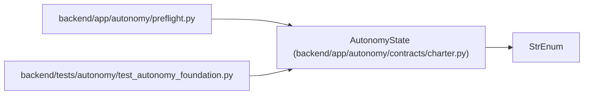

# AutonomyState

**Location:** `backend/app/autonomy/contracts/charter.py:37`
**Kind:** Enum
**Bases:** `StrEnum`
**Module:** [charter](../modules/charter.md)

## Description

_Auto-generated from `AutonomyState` in `backend/app/autonomy/contracts/charter.py`._

## Attributes

| Name | Declared value | Description |
|------|-------|-------------|
| `NOT_READY` | `'AUTONOMY-NOT-READY'` | — |
| `BLOCKED_EXTERNAL` | `'BLOCKED_EXTERNAL'` | — |
| `QUALIFIED` | `'AUTONOMY-QUALIFIED'` | — |

## Methods

*No public methods. Inherits from base classes.*

## Relationships

<!-- Auto-generated relationship summary. Do not edit by hand. -->

### Summary

| Module | Methods | Attributes |
|---|---:|---|
| [charter](../modules/charter.md) | 0 | `BLOCKED_EXTERNAL`, `NOT_READY`, `QUALIFIED` |

### Structure

| Kind | Entity | Module |
|---|---|---|
| Base | `StrEnum` | — |

### References

| Reference | Kind | Source | Call sites |
|---|---|---|---:|
| `preflight` | import | [preflight](../modules/preflight.md) | — |
| `test_autonomy_foundation` | import | [test_autonomy_foundation](../modules/test_autonomy_foundation.md) | — |
