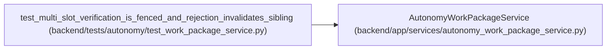

# AutonomyWorkPackageService

**Location:** `backend/app/services/autonomy_work_package_service.py:44`
**Kind:** Class
**Bases:** —
**Module:** [autonomy_work_package_service](../modules/autonomy_work_package_service.md)

## Description

Mirror external-journal decisions without letting Task.status accept work.

## Attributes

*No annotated attributes found.*

## Methods

| Method | Signature | Decorators | Description |
|--------|-----------|------------|-------------|
| `__init__` | `(db: AsyncSession)` | — | — |
| `create_package` | *(async)* `(controller: AgentActor, data: AgentWorkPackageCreate) -> AgentWorkPackageResponse` | — | — |
| `activate_requirements` | *(async)* `(controller: AgentActor, *, package_id: int, external_journal_revision: int, external_journal_head_digest: str, idempotency_key: str) -> AgentWorkPackageResponse` | — | — |
| `claim_requirement` | *(async)* `(actor: AgentActor, data: VerificationClaimRequest, *, resolved_lease: ResolvedVerifierLease, idempotency_key: str) -> VerificationTransitionResponse` | — | — |
| `begin_requirement` | *(async)* `(actor: AgentActor, data: VerificationBeginRequest, *, resolved_lease: ResolvedVerifierLease, idempotency_key: str) -> VerificationTransitionResponse` | — | — |
| `renew_requirement` | *(async)* `(actor: AgentActor, data: VerificationRenewRequest, *, resolved_lease: ResolvedVerifierLease, idempotency_key: str) -> VerificationTransitionResponse` | — | — |
| `submit_requirement` | *(async)* `(actor: AgentActor, data: VerificationSubmitRequest, *, resolved_lease: ResolvedVerifierLease, idempotency_key: str) -> VerificationTransitionResponse` | — | — |
| `expire_leases` | *(async)* `(*, observed_at: datetime, external_journal_revision: int, external_journal_head_digest: str) -> tuple[int, ...]` | — | Expire every overdue live slot; caller first commits one journal event. |
| `_lease_transition` | *(async)* `(actor: AgentActor, *, data: VerificationBeginRequest \| VerificationRenewRequest, resolved_lease: ResolvedVerifierLease, idempotency_key: str, expected_state: str, next_state: str, expected_action: str, event_type: str) -> VerificationTransitionResponse` | — | — |
| `_require_topology_member` | *(async)* `(actor: AgentActor, requirement: AgentVerificationRequirement, lease: ResolvedVerifierLease) -> AgentAutonomyTopologyMember` | — | — |
| `_require_controller` | `(actor: AgentActor) -> None` | `@staticmethod` | — |
| `_require_verifier` | `(actor: AgentActor) -> None` | `@staticmethod` | — |
| `_idempotency` | `(value: str) -> str` | `@staticmethod` | — |
| `_child_key` | `(parent: str, suffix: str) -> str` | `@staticmethod` | — |
| `_validate_owned_fence` | `(actor: AgentActor, requirement, data) -> None` | `@staticmethod` | — |
| `_validate_lease` | `(actor: AgentActor, requirement: AgentVerificationRequirement, package: AgentWorkPackage, lease: ResolvedVerifierLease, *, expected_action: str) -> None` | `@staticmethod` | — |
| `_require_unexpired` | `(requirement: AgentVerificationRequirement) -> None` | `@staticmethod` | — |
| `_adopt_lease` | `(requirement: AgentVerificationRequirement, lease: ResolvedVerifierLease) -> None` | `@staticmethod` | — |
| `_advance_journal` | `(package: AgentWorkPackage, *, revision: int, head_digest: str, allow_equal: bool = False) -> None` | `@staticmethod` | — |
| `_append_event` | *(async)* `(requirement: AgentVerificationRequirement, *, event_type: str, actor_id: int \| None, payload_digest: str, idempotency_key: str) -> AgentVerificationEvent` | — | — |
| `_event_replay` | *(async)* `(requirement: AgentVerificationRequirement, idempotency_key: str, payload_digest: str) -> bool` | — | — |
| `_matching_event` | *(async)* `(requirements: list[AgentVerificationRequirement], idempotency_key: str, payload_digest: str) -> bool` | — | — |
| `_lock_package` | *(async)* `(package_id: int) -> AgentWorkPackage` | — | — |
| `_lock_requirement` | *(async)* `(requirement_id: int) -> AgentVerificationRequirement` | — | — |
| `_lock_requirements` | *(async)* `(package_id: int) -> list[AgentVerificationRequirement]` | — | — |
| `_load_package` | *(async)* `(package_id: int) -> AgentWorkPackage` | — | — |
| `_load_requirement` | *(async)* `(requirement_id: int) -> AgentVerificationRequirement` | — | — |
| `requirement_response` | `(requirement: AgentVerificationRequirement) -> VerificationRequirementResponse` | `@staticmethod` | — |
| `package_response` | `(package: AgentWorkPackage) -> AgentWorkPackageResponse` | `@classmethod` | — |
| `transition_response` | `(requirement: AgentVerificationRequirement, package: AgentWorkPackage, *, verdict: str \| None = None) -> VerificationTransitionResponse` | `@classmethod` | — |
| `_request_fingerprint` | `(data: AgentWorkPackageCreate) -> str` | `@staticmethod` | — |

## Relationships

<!-- Auto-generated relationship summary. Do not edit by hand. -->

### Summary

| Module | Methods | Attributes |
|---|---:|---|
| [autonomy_work_package_service](../modules/autonomy_work_package_service.md) | 31 | — |

### References

| Reference | Kind | Source | Call sites |
|---|---|---|---:|
| `test_multi_slot_verification_is_fenced_and_rejection_invalidates_sibling` | call | [test_work_package_service](../modules/test_work_package_service.md) | 1 |
