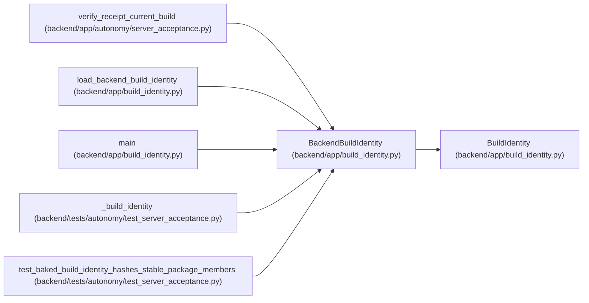

# BackendBuildIdentity

**Location:** `backend/app/build_identity.py:32`
**Kind:** Pydantic model
**Bases:** `BuildIdentity`
**Module:** [build_identity](../modules/build_identity.md)

## Description

Backend package identity plus its independently built gateway digest.

## Attributes

| Name | Type | Wire name | Required | Nullable | Default | Constraints | Examples | Description |
|------|------|-----------|----------|----------|---------|-------------|-------------|----------|
| `component` | `Literal['backend']` | `component` | No | No | `'backend'` | — | — | — |
| `expected_frontend_artifact_digest` | `str` | `expected_frontend_artifact_digest` | Yes | No | — | pattern=unknown (SHA256_PATTERN) | — | — |

## Methods

*No public methods. Inherits from base classes.*

## Relationships

<!-- Auto-generated relationship summary. Do not edit by hand. -->

### Summary

| Module | Methods | Attributes |
|---|---:|---|
| [build_identity](../modules/build_identity.md) | 0 | `component`, `expected_frontend_artifact_digest` |

### Structure

| Kind | Entity | Module |
|---|---|---|
| Base | `BuildIdentity` | [build_identity](../modules/build_identity.md) |

### References

| Reference | Kind | Source | Call sites |
|---|---|---|---:|
| `verify_receipt_current_build` | type_reference | [autonomy_server_acceptance](../modules/autonomy_server_acceptance.md) | — |
| `load_backend_build_identity` | type_reference | [build_identity](../modules/build_identity.md) | — |
| `main` | call | [build_identity](../modules/build_identity.md) | 1 |
| `_build_identity` | call | [test_server_acceptance](../modules/test_server_acceptance.md) | 1 |
| `_build_identity` | type_reference | [test_server_acceptance](../modules/test_server_acceptance.md) | — |
| `test_baked_build_identity_hashes_stable_package_members` | call | [test_server_acceptance](../modules/test_server_acceptance.md) | 1 |
