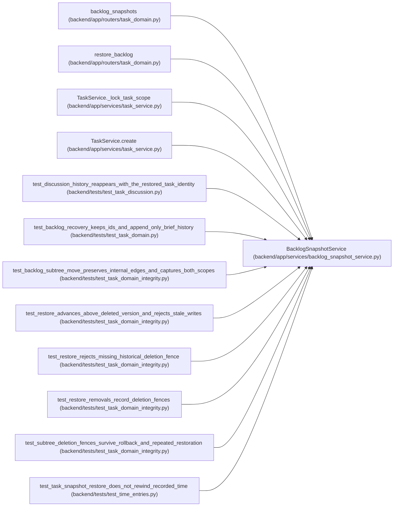

# BacklogSnapshotService

**Location:** `backend/app/services/backlog_snapshot_service.py:19`
**Kind:** Class
**Bases:** —
**Module:** [backlog_snapshot_service](../modules/backlog_snapshot_service.md)

## Description

_Auto-generated from `BacklogSnapshotService` in `backend/app/services/backlog_snapshot_service.py`._

Scheduled and backlog restoration share a version allocator under the owning scope lock. It advances above the saved version, live task, retained history and durable deletion fence. Current progress and acceptance are cleared; immutable history survives. A deleted task without a reliable deletion fence returns snapshot_version_history_unknown (409), requiring recovery from a complete matching database backup.

## Attributes

*No annotated attributes found.*

## Methods

| Method | Signature | Decorators | Description |
|--------|-----------|------------|-------------|
| `__init__` | `(db)` | — | — |
| `capture` | *(async)* `(project_id, reason = 'manual')` | `@atomic_command` | — |
| `list` | *(async)* `(project_id)` | — | — |
| `restore` | *(async)* `(project_id, snapshot_id, expected_versions, *, reason)` | `@atomic_command` | — |

## Relationships

<!-- Auto-generated relationship summary. Do not edit by hand. -->

### Summary

| Module | Methods | Attributes |
|---|---:|---|
| [backlog_snapshot_service](../modules/backlog_snapshot_service.md) | 4 | — |

### References

| Reference | Kind | Source | Call sites |
|---|---|---|---:|
| `backlog_snapshots` | call | [routers_task_domain](../modules/routers_task_domain.md) | 1 |
| `restore_backlog` | call | [routers_task_domain](../modules/routers_task_domain.md) | 1 |
| `TaskService._lock_task_scope` | call | [task_service](../modules/task_service.md) | 1 |
| `TaskService.create` | call | [task_service](../modules/task_service.md) | 1 |
| `test_discussion_history_reappears_with_the_restored_task_identity` | call | [test_task_discussion](../modules/test_task_discussion.md) | 2 |
| `test_backlog_recovery_keeps_ids_and_append_only_brief_history` | call | [test_task_domain](../modules/test_task_domain.md) | 1 |
| `test_backlog_subtree_move_preserves_internal_edges_and_captures_both_scopes` | call | [test_task_domain_integrity](../modules/test_task_domain_integrity.md) | 2 |
| `test_restore_advances_above_deleted_version_and_rejects_stale_writes` | call | [test_task_domain_integrity](../modules/test_task_domain_integrity.md) | 1 |
| `test_restore_rejects_missing_historical_deletion_fence` | call | [test_task_domain_integrity](../modules/test_task_domain_integrity.md) | 1 |
| `test_restore_removals_record_deletion_fences` | call | [test_task_domain_integrity](../modules/test_task_domain_integrity.md) | 1 |
| `test_subtree_deletion_fences_survive_rollback_and_repeated_restoration` | call | [test_task_domain_integrity](../modules/test_task_domain_integrity.md) | 1 |
| `test_task_snapshot_restore_does_not_rewind_recorded_time` | call | [test_time_entries](../modules/test_time_entries.md) | 1 |
