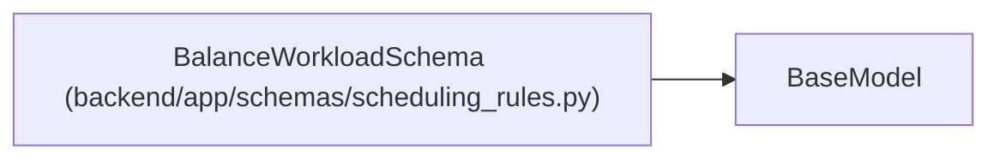

# BalanceWorkloadSchema

**Location:** `backend/app/schemas/scheduling_rules.py:37`
**Kind:** Pydantic model
**Bases:** `BaseModel`
**Module:** [schemas_scheduling_rules](../modules/schemas_scheduling_rules.md)

## Description

Workload balancing configuration.

## Attributes

| Name | Type | Wire name | Required | Nullable | Default | Constraints | Examples | Description |
|------|------|-----------|----------|----------|---------|-------------|-------------|----------|
| `enabled` | `bool` | `enabled` | No | No | `False` | — | — | Enable workload balancing |
| `max_overload_percent` | `float` | `max_overload_percent` | No | No | `10` | ge=0; le=100 | — | Maximum allowed overload percentage |

## Methods

*No public methods. Inherits from base classes.*

## Relationships

<!-- Auto-generated relationship summary. Do not edit by hand. -->

### Summary

| Module | Methods | Attributes |
|---|---:|---|
| [schemas_scheduling_rules](../modules/schemas_scheduling_rules.md) | 0 | `enabled`, `max_overload_percent` |

### Structure

| Kind | Entity | Module |
|---|---|---|
| Base | `BaseModel` | — |
