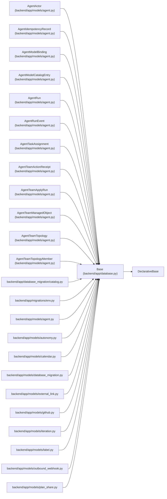

# Base

**Location:** `backend/app/database.py:36`
**Kind:** Class
**Bases:** `DeclarativeBase`
**Module:** [app_database](../modules/app_database.md)

## Description

Base class for all models.

## Attributes

*No annotated attributes found.*

## Methods

*No public methods. Inherits from base classes.*

## Relationships

<!-- Auto-generated relationship summary. Do not edit by hand. -->

### Summary

| Module | Methods | Attributes |
|---|---:|---|
| [app_database](../modules/app_database.md) | 0 | — |

### Structure

| Kind | Entity | Module |
|---|---|---|
| Base | `DeclarativeBase` | — |
| Subclass | `AgentActor` | [models_agent](../modules/models_agent.md) |
| Subclass | `AgentIdempotencyRecord` | [models_agent](../modules/models_agent.md) |
| Subclass | `AgentModelBinding` | [models_agent](../modules/models_agent.md) |
| Subclass | `AgentModelCatalogEntry` | [models_agent](../modules/models_agent.md) |
| Subclass | `AgentRun` | [models_agent](../modules/models_agent.md) |
| Subclass | `AgentRunEvent` | [models_agent](../modules/models_agent.md) |
| Subclass | `AgentTaskAssignment` | [models_agent](../modules/models_agent.md) |
| Subclass | `AgentTeamActionReceipt` | [models_agent](../modules/models_agent.md) |
| Subclass | `AgentTeamApplyRun` | [models_agent](../modules/models_agent.md) |
| Subclass | `AgentTeamManagedObject` | [models_agent](../modules/models_agent.md) |
| Subclass | `AgentTeamTopology` | [models_agent](../modules/models_agent.md) |
| Subclass | `AgentTeamTopologyMember` | [models_agent](../modules/models_agent.md) |

### References

| Reference | Kind | Source | Call sites |
|---|---|---|---:|
| `catalog` | import | [catalog](../modules/catalog.md) | — |
| `env` | import | [migrations_env](../modules/migrations_env.md) | — |
| `agent` | import | [models_agent](../modules/models_agent.md) | — |
| `autonomy` | import | [models_autonomy](../modules/models_autonomy.md) | — |
| `calendar` | import | [models_calendar](../modules/models_calendar.md) | — |
| `database_migration` | import | [models_database_migration](../modules/models_database_migration.md) | — |
| `external_link` | import | [models_external_link](../modules/models_external_link.md) | — |
| `github` | import | [models_github](../modules/models_github.md) | — |
| `iteration` | import | [models_iteration](../modules/models_iteration.md) | — |
| `label` | import | [models_label](../modules/models_label.md) | — |
| `outbound_webhook` | import | [models_outbound_webhook](../modules/models_outbound_webhook.md) | — |
| `plan_share` | import | [models_plan_share](../modules/models_plan_share.md) | — |

> References: showing 12 of 29 logical references; 17 omitted by the 12-row generated summary limit.
