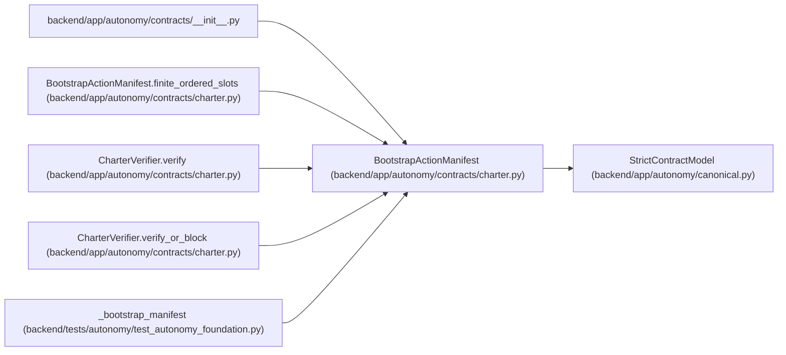

# BootstrapActionManifest

**Location:** `backend/app/autonomy/contracts/charter.py:271`
**Kind:** Pydantic model
**Bases:** `StrictContractModel`
**Module:** [charter](../modules/charter.md)

## Description

_Auto-generated from `BootstrapActionManifest` in `backend/app/autonomy/contracts/charter.py`._

## Validators

| Method | Scope | Fields | Mode | Options |
|--------|-------|--------|------|---------|
| `finite_ordered_slots` | model | — | after | — |

## Attributes

| Name | Type | Wire name | Required | Nullable | Default | Constraints | Examples | Description |
|------|------|-----------|----------|----------|---------|-------------|-------------|----------|
| `schema_version` | `Literal['bootstrap-action-manifest-v1']` | `schema_version` | No | No | `'bootstrap-action-manifest-v1'` | — | — | — |
| `manifest_id` | `str` | `manifest_id` | Yes | No | — | pattern=unknown (IDENTIFIER_PATTERN) | — | — |
| `charter_id` | `str` | `charter_id` | Yes | No | — | pattern=unknown (IDENTIFIER_PATTERN) | — | — |
| `journal_genesis_digest` | `str` | `journal_genesis_digest` | Yes | No | — | pattern=unknown (SHA256_PATTERN) | — | — |
| `journal_expected_head_digest` | `str` | `journal_expected_head_digest` | Yes | No | — | pattern=unknown (SHA256_PATTERN) | — | — |
| `issued_at` | `datetime` | `issued_at` | Yes | No | — | — | — | — |
| `expires_at` | `datetime` | `expires_at` | Yes | No | — | — | — | — |
| `slots` | `tuple[BootstrapActionSlot, ...]` | `slots` | Yes | No | — | max_length=100000; min_length=1 | — | — |

## Methods

| Method | Signature | Decorators | Description |
|--------|-----------|------------|-------------|
| `finite_ordered_slots` | `() -> 'BootstrapActionManifest'` | `@model_validator(mode='after')` | — |

## Relationships

<!-- Auto-generated relationship summary. Do not edit by hand. -->

### Summary

| Module | Methods | Attributes |
|---|---:|---|
| [charter](../modules/charter.md) | 1 | `charter_id`, `expires_at`, `issued_at`, `journal_expected_head_digest`, `journal_genesis_digest`, `manifest_id`, `schema_version`, `slots` |

### Structure

| Kind | Entity | Module |
|---|---|---|
| Base | `StrictContractModel` | [autonomy_canonical](../modules/autonomy_canonical.md) |

### References

| Reference | Kind | Source | Call sites |
|---|---|---|---:|
| `__init__` | import | [contracts___init__](../modules/contracts___init__.md) | — |
| `BootstrapActionManifest.finite_ordered_slots` | type_reference | [charter](../modules/charter.md) | — |
| `CharterVerifier.verify` | type_reference | [charter](../modules/charter.md) | — |
| `CharterVerifier.verify_or_block` | type_reference | [charter](../modules/charter.md) | — |
| `_bootstrap_manifest` | call | [test_autonomy_foundation](../modules/test_autonomy_foundation.md) | 1 |
| `_bootstrap_manifest` | type_reference | [test_autonomy_foundation](../modules/test_autonomy_foundation.md) | — |
