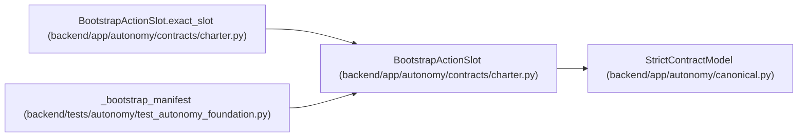

# BootstrapActionSlot

**Location:** `backend/app/autonomy/contracts/charter.py:238`
**Kind:** Pydantic model
**Bases:** `StrictContractModel`
**Module:** [charter](../modules/charter.md)

## Description

One finite externally preissued bootstrap mutation slot.

## Validators

| Method | Scope | Fields | Mode | Options |
|--------|-------|--------|------|---------|
| `exact_slot` | model | — | after | — |

## Attributes

| Name | Type | Wire name | Required | Nullable | Default | Constraints | Examples | Description |
|------|------|-----------|----------|----------|---------|-------------|-------------|----------|
| `ordinal` | `int` | `ordinal` | Yes | No | — | ge=1; le=100000 | — | — |
| `slot_id` | `str` | `slot_id` | Yes | No | — | pattern=unknown (IDENTIFIER_PATTERN) | — | — |
| `subject` | `Literal['pg-bootstrap-controller', 'pg-bootstrap-builder', 'pg-bootstrap-verifier']` | `subject` | Yes | No | — | — | — | — |
| `action` | `str` | `action` | Yes | No | — | min_length=1; max_length=255 | — | — |
| `target_ref` | `str` | `target_ref` | Yes | No | — | max_length=1024; pattern=unknown (OPAQUE_REF_PATTERN) | — | — |
| `target_generation` | `str` | `target_generation` | Yes | No | — | min_length=1; max_length=255 | — | — |
| `precondition_digest` | `str` | `precondition_digest` | Yes | No | — | pattern=unknown (SHA256_PATTERN) | — | — |
| `input_schema` | `str` | `input_schema` | Yes | No | — | pattern=unknown (IDENTIFIER_PATTERN) | — | — |
| `output_schema` | `str` | `output_schema` | Yes | No | — | pattern=unknown (IDENTIFIER_PATTERN) | — | — |
| `journal_parent_digest` | `str` | `journal_parent_digest` | Yes | No | — | pattern=unknown (SHA256_PATTERN) | — | — |
| `timeout_seconds` | `int` | `timeout_seconds` | Yes | No | — | ge=1; le=86400 | — | — |
| `maximum_calls` | `int` | `maximum_calls` | Yes | No | — | ge=1; le=100 | — | — |
| `maximum_spend_minor_units` | `int` | `maximum_spend_minor_units` | Yes | No | — | ge=0 | — | — |
| `nonce` | `str` | `nonce` | Yes | No | — | pattern=unknown (IDENTIFIER_PATTERN) | — | — |
| `reset_effect` | `str` | `reset_effect` | Yes | No | — | min_length=1; max_length=512 | — | — |

## Methods

| Method | Signature | Decorators | Description |
|--------|-----------|------------|-------------|
| `exact_slot` | `() -> 'BootstrapActionSlot'` | `@model_validator(mode='after')` | — |

## Relationships

<!-- Auto-generated relationship summary. Do not edit by hand. -->

### Summary

| Module | Methods | Attributes |
|---|---:|---|
| [charter](../modules/charter.md) | 1 | `action`, `input_schema`, `journal_parent_digest`, `maximum_calls`, `maximum_spend_minor_units`, `nonce`, `ordinal`, `output_schema`, `precondition_digest`, `reset_effect`, `slot_id`, `subject` |

### Structure

| Kind | Entity | Module |
|---|---|---|
| Base | `StrictContractModel` | [autonomy_canonical](../modules/autonomy_canonical.md) |

### References

| Reference | Kind | Source | Call sites |
|---|---|---|---:|
| `BootstrapActionSlot.exact_slot` | type_reference | [charter](../modules/charter.md) | — |
| `_bootstrap_manifest` | call | [test_autonomy_foundation](../modules/test_autonomy_foundation.md) | 1 |
