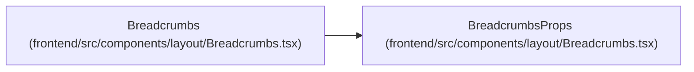

# BreadcrumbsProps

**Location:** `frontend/src/components/layout/Breadcrumbs.tsx:10`
**Kind:** Class
**Bases:** —
**Module:** [Breadcrumbs](../modules/Breadcrumbs.md)

## Description

_Auto-generated from `BreadcrumbsProps` in `frontend/src/components/layout/Breadcrumbs.tsx`._

## Attributes

| Name | Type | Default | Description |
|------|------|---------|-------------|
| `items` | `BreadcrumbItem[]` | *required* | — |
| `label` | `string` | *required* | — |

## Methods

*No public methods. Inherits from base classes.*

## Relationships

<!-- Auto-generated relationship summary. Do not edit by hand. -->

### Summary

| Module | Methods | Attributes |
|---|---:|---|
| [Breadcrumbs](../modules/Breadcrumbs.md) | 0 | `items`, `label` |

### References

| Reference | Kind | Source | Call sites |
|---|---|---|---:|
| `Breadcrumbs` | type_reference | [Breadcrumbs](../modules/Breadcrumbs.md) | — |
