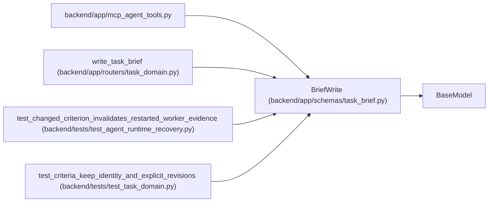

# BriefWrite

**Location:** `backend/app/schemas/task_brief.py:44`
**Kind:** Pydantic model
**Bases:** `BaseModel`
**Module:** [schemas_task_brief](../modules/schemas_task_brief.md)

## Description

_Auto-generated from `BriefWrite` in `backend/app/schemas/task_brief.py`._

## Model Configuration

| Setting | Value | Source |
|---------|-------|--------|
| `extra` | `'forbid'` | model_config |

## Attributes

| Name | Type | Wire name | Required | Nullable | Default | Constraints | Examples | Description |
|------|------|-----------|----------|----------|---------|-------------|-------------|----------|
| `expected_version` | `int` | `expected_version` | Yes | No | — | ge=1 | — | — |
| `brief` | `TaskBrief` | `brief` | Yes | No | — | — | — | — |

## Methods

*No public methods. Inherits from base classes.*

## Relationships

<!-- Auto-generated relationship summary. Do not edit by hand. -->

### Summary

| Module | Methods | Attributes |
|---|---:|---|
| [schemas_task_brief](../modules/schemas_task_brief.md) | 0 | `brief`, `expected_version` |

### Structure

| Kind | Entity | Module |
|---|---|---|
| Base | `BaseModel` | — |

### References

| Reference | Kind | Source | Call sites |
|---|---|---|---:|
| `mcp_agent_tools` | import | [mcp_agent_tools](../modules/mcp_agent_tools.md) | — |
| `write_task_brief` | type_reference | [routers_task_domain](../modules/routers_task_domain.md) | — |
| `test_changed_criterion_invalidates_restarted_worker_evidence` | call | [test_agent_runtime_recovery](../modules/test_agent_runtime_recovery.md) | 1 |
| `test_criteria_keep_identity_and_explicit_revisions` | call | [test_task_domain](../modules/test_task_domain.md) | 3 |
