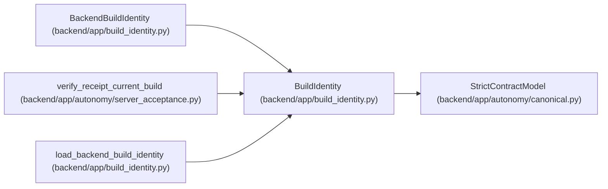

# BuildIdentity

**Location:** `backend/app/build_identity.py:21`
**Kind:** Pydantic model
**Bases:** `StrictContractModel`
**Module:** [build_identity](../modules/build_identity.md)

## Description

Content identity written while an image is built.

## Attributes

| Name | Type | Wire name | Required | Nullable | Default | Constraints | Examples | Description |
|------|------|-----------|----------|----------|---------|-------------|-------------|----------|
| `schema_version` | `Literal['workchord-build-identity-v1']` | `schema_version` | No | No | `'workchord-build-identity-v1'` | — | — | — |
| `component` | `Literal['backend', 'frontend']` | `component` | Yes | No | — | — | — | — |
| `source_revision` | `str` | `source_revision` | Yes | No | — | pattern=unknown (REVISION_PATTERN) | — | — |
| `artifact_digest` | `str` | `artifact_digest` | Yes | No | — | pattern=unknown (SHA256_PATTERN) | — | — |

## Methods

*No public methods. Inherits from base classes.*

## Relationships

<!-- Auto-generated relationship summary. Do not edit by hand. -->

### Summary

| Module | Methods | Attributes |
|---|---:|---|
| [build_identity](../modules/build_identity.md) | 0 | `artifact_digest`, `component`, `schema_version`, `source_revision` |

### Structure

| Kind | Entity | Module |
|---|---|---|
| Base | `StrictContractModel` | [autonomy_canonical](../modules/autonomy_canonical.md) |
| Subclass | `BackendBuildIdentity` | [build_identity](../modules/build_identity.md) |

### References

| Reference | Kind | Source | Call sites |
|---|---|---|---:|
| `verify_receipt_current_build` | type_reference | [autonomy_server_acceptance](../modules/autonomy_server_acceptance.md) | — |
| `load_backend_build_identity` | type_reference | [build_identity](../modules/build_identity.md) | — |
